# ResonantDAO — Contribution Economy Workflows (BPMN 2.0)

This directory contains BPMN 2.0 models of the ResonantDAO contribution economy: the 22 contribution dimensions (Major Arcana, C_0–C_21), their cross-dimension interactions, and the $RCT aggregation workflow that summarizes them. The models mirror the design spec at [`docs/superpowers/specs/2026-09-16-contribution-economy-workflows-design.md`](../superpowers/specs/2026-09-16-contribution-economy-workflows-design.md) and the source page at https://resonantdao.com/contribution-economy/ .

**How to view:** open `index.html` in a browser (or serve this directory with `python3 -m http.server` and browse to the served page). Diagrams also validate structurally via `npm run validate`.

## File index

| File | Diagram | Badge | One-line function |
| --- | --- | --- | --- |
| `bpmn/00-master-lifecycle.bpmn` | Master Contribution Lifecycle | `core` | Action → evidence → classification P(a) → tiered verification (T0–T3) → harm check → delta formula → 22 balances → cycle boundary → $RCT aggregation. |
| `bpmn/20-interaction-map.bpmn` | Dimension Interaction Map | `core` | Rails (C_2 records, C_18 verification, C_4 rules, C_11 audits, C_15 distortion audits) + cross-dimension flow dependencies + cycle spine C_10 → C_20 → C_21 → aggregation. |
| `bpmn/21-aggregation-rct.bpmn` | $RCT Aggregation Workflow | `core` | Cycle boundary → null-preserving normalization N_i → capital-portion exclusion → human governance of alpha_i → aggregate → use gate (eligibility/quorum only, never vote scaling) → publish + update 22-vector. |
| `bpmn/c00-fool.bpmn` | C_0 Fool — Entry | `specified` | Entry/pioneering step. Entry event is a verified zero; validated crossings earn non-zero value. |
| `bpmn/c01-magician.bpmn` | C_1 Magician — Building | `specified` | Delivery bounty on acceptance, sized by scope; never on submission. |
| `bpmn/c02-priestess.bpmn` | C_2 Priestess — Recording | `specified` | Base credit on publication + usage bonus per verified retrieval. Evidence rails for all dimensions. |
| `bpmn/c03-empress.bpmn` | C_3 Empress — Nurturing | `specified` | Multiplier: percentage of mentee's accepted output, capped per mentee, cycle-gated. |
| `bpmn/c04-emperor.bpmn` | C_4 Emperor — Rule Changes | `proposed interpretation` | Governance bounty on adopted rule change after ratification vote; proposal alone pays nothing. |
| `bpmn/c05-hierophant.bpmn` | C_5 Hierophant — Teaching | `specified` | Pays on demonstrated competence in another member; lectures and attendance pay nothing. |
| `bpmn/c06-lovers.bpmn` | C_6 Lovers — Joint Builds | `proposed interpretation` | Shared delivery bounty on accepted joint artifact, split by verified attribution. |
| `bpmn/c07-chariot.bpmn` | C_7 Chariot — Milestones | `proposed interpretation` | Milestone token on verified milestone, net-of-harm. |
| `bpmn/c08-strength.bpmn` | C_8 Strength — Resolving | `specified` | Resolution token sized by severity; requires non-party resolver and both parties' written acceptance. |
| `bpmn/c09-hermit.bpmn` | C_9 Hermit — Discovering | `specified` | Deep-work bounty at milestones + adoption bonus when a finding steers a vote; never on length. |
| `bpmn/c10-wheel.bpmn` | C_10 Wheel — Fair Cycle Completion | `proposed interpretation` | Cycle-completion credit on audited fair cycle close; fires the aggregation boundary event. |
| `bpmn/c11-justice.bpmn` | C_11 Justice — Audits / Calibration | `proposed interpretation` | Audit token per completed fairness audit; human-only during bootstrap; triggers back-pay/calibration on under-recognition. |
| `bpmn/c12-hanged-man.bpmn` | C_12 Hanged Man — Re-seeing | `specified` | Pays on decision-changed; never on pause duration. |
| `bpmn/c13-death.bpmn` | C_13 Death — Ending | `specified` | Closure token requiring preserved learning and verified resource release; feeds C_14. |
| `bpmn/c14-temperance.bpmn` | C_14 Temperance — Health in Range | `proposed interpretation` | Holding credit per in-range interval with stall detection; consumes resources released by C_13. |
| `bpmn/c15-devil.bpmn` | C_15 Devil — Exposing | `specified` | Integrity bounty, among the largest payouts; corroboration required; false claims penalized. |
| `bpmn/c16-tower.bpmn` | C_16 Tower — Crisis Response | `specified` | Crisis token sized by severity; pays stabilization, not detection or caused failure. |
| `bpmn/c17-star.bpmn` | C_17 Star — Orientation | `proposed interpretation` | Onboarding credit when orientee completes first verified contribution; attendance alone pays nothing. |
| `bpmn/c18-moon.bpmn` | C_18 Moon — Verifying | `specified` | Verification token per completed check regardless of direction; accuracy tracked against chance. |
| `bpmn/c19-sun.bpmn` | C_19 Sun — Public Recognition | `proposed interpretation` | Recognition credit only when tied to a verified record. |
| `bpmn/c20-judgement.bpmn` | C_20 Judgement — Reckoning | `proposed interpretation` | End-of-cycle reckoning and provenance settlement; unresolved judgments stay pending and settle retroactively. |
| `bpmn/c21-world.bpmn` | C_21 World — Completion | `proposed interpretation` | Completion credit on verified whole-cycle completion; closes the cycle spine into aggregation. |

## Cross-dimension dependencies

| Source | Target | What flows |
| --- | --- | --- |
| C_2 Priestess | C_0, C_1, C_5, C_9, C_19 | evidence records |
| C_18 Moon | C_16, C_8, C_13 | verification verdicts for pending claims |
| C_1 Magician | C_3 Empress | mentee's accepted artifact (multiplier input) |
| C_5 Hierophant | C_3 Empress | demonstrated competence as nurture evidence |
| C_9 Hermit | C_20 Judgement | decision-steering evidence (adoption bonus) |
| C_12 Hanged Man | C_20 Judgement | decision-changed evidence |
| C_13 Death | C_14 Temperance | released resources feed health metric |
| C_17 Star | C_0 Fool | orientation feeds entry |
| C_17 Star | C_1 Magician | orientee's first verified contribution |
| C_15 Devil | C_11 Justice + 21-aggregation-rct | weight distortion findings |
| C_11 Justice | 21-aggregation-rct | calibration updates + fairness audit |
| C_10 Wheel | C_20 Judgement | fair cycle close |
| C_20 Judgement | C_21 World | settled provenance |
| C_21 World | 21-aggregation-rct | whole-cycle completion |
| C_4 Emperor | 21-aggregation-rct | adopted rules / calibration versions |
| C_19 Sun | C_2 Priestess | recognition must tie to verified record |
| C_16 Tower | C_18 Moon | crisis verification request |

## Master lifecycle mirror

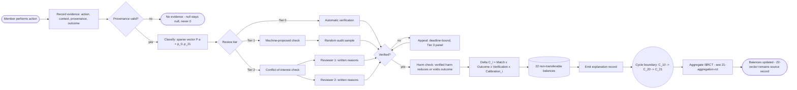

## $RCT aggregation mirror

```mermaid
flowchart LR
  S(([Cycle boundary: C_10 fair close + C_20 provenance settled])) --> N[Normalize N_i C_i - null preserving, null never becomes 0, never decays]
  N --> X{Capital-derived portion?}
  X -->|yes| EX[Exclude from voting-relevant aggregation] --> W
  X -->|no| W[Human governance: review alpha_i weights + version]
  FA[C_11 Justice fairness audit] --> W
  DA[C_15 Devil distortion audit] --> W
  W --> CV[Emit calibration-version explanation record]
  CV --> A[Aggregate: RCT = aggregate alpha_i x N_i C_i]
  A --> P{Profile preserved - RCT summarizes, never erases?}
  P -->|no| A
  P -->|yes| U{Use gate}
  U -->|eligibility / quorum only| PUB[Publish summary + update 22-vector] --> DONE([Cycle settled])
  U -.->|FORBIDDEN: scale voting weight| STOP([Rejected - RCT never scales votes])
```

## Per-dimension mirrors

Mirrors of each dimension model's actual flow: start event → evidence/gate tasks → gateways with branch labels → payment task → explanation record → feed tasks → end events.

### C_0 Fool — Entry

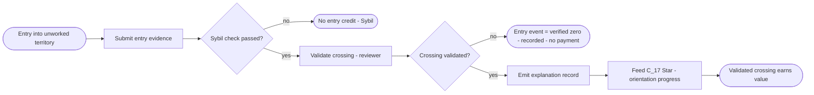

### C_1 Magician — Building

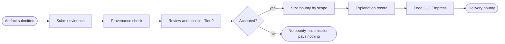

### C_2 Priestess — Recording

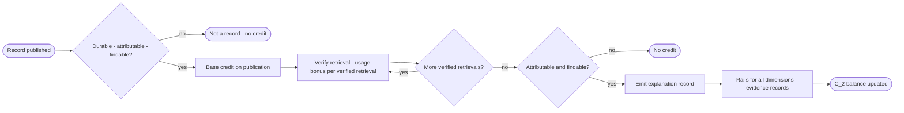

### C_3 Empress — Nurturing

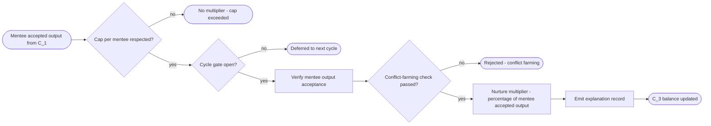

### C_4 Emperor — Rule Changes

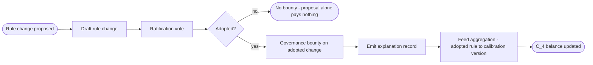

### C_5 Hierophant — Teaching

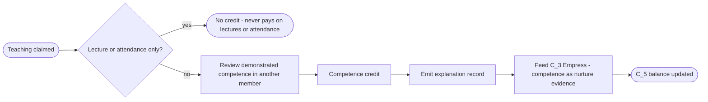

### C_6 Lovers — Joint Builds

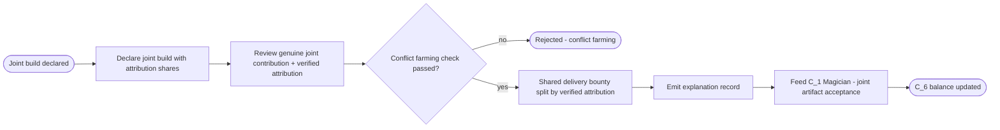

### C_7 Chariot — Milestones

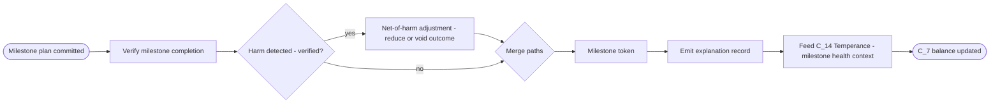

### C_8 Strength — Resolving

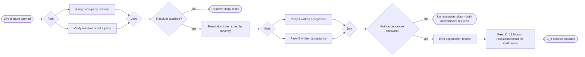

### C_9 Hermit — Discovering

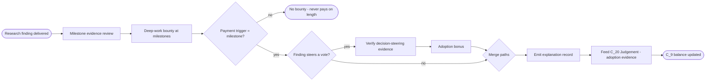

### C_10 Wheel — Fair Cycle Completion

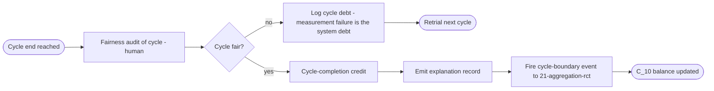

### C_11 Justice — Audits / Calibration

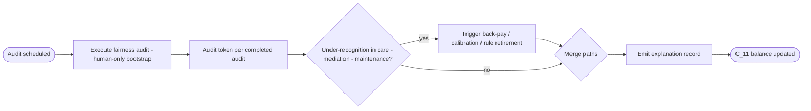

### C_12 Hanged Man — Re-seeing

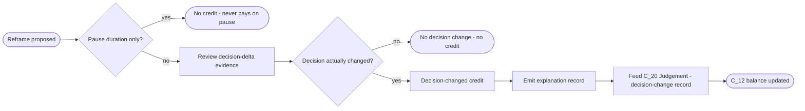

### C_13 Death — Ending

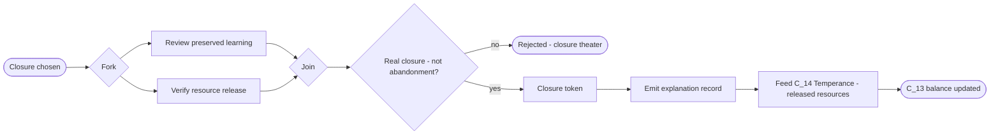

### C_14 Temperance — Health in Range

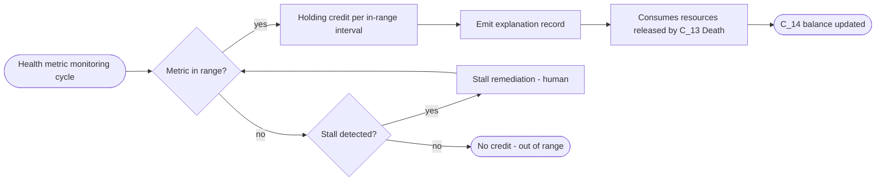

### C_15 Devil — Exposing

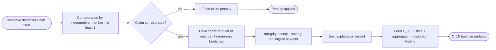

### C_16 Tower — Crisis Response

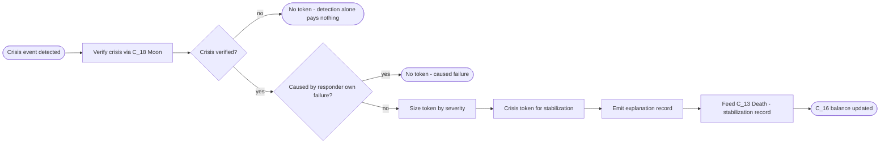

### C_17 Star — Orientation

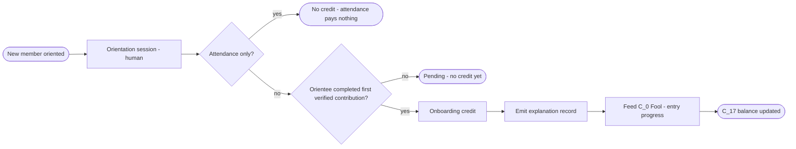

### C_18 Moon — Verifying

```mermaid
flowchart LR
  S([Pending claim enqueued]) --> G1{More pending claims?}
  G1 -->|no| E1([Queue drained])
  G1 -->|yes| V[Complete verification check] --> T[Verification token per completed check - any direction] --> ACC[Track accuracy vs chance] --> G2{Reviewer capture suspected?}
  G2 -->|yes| ROT[Rotate reviewer pool - Tier 3] --> G1
  G2 -->|no| RC[Emit explanation record] --> F[Verdicts feed all dimensions pending claims] --> E2([C_18 balance updated])
```

### C_19 Sun — Public Recognition

```mermaid
flowchart LR
  S([Recognition nomination]) --> G{Tied to verified record?}
  G -->|no| E1([Rejected - popularity alone pays nothing])
  G -->|yes| RV[Recognition review] --> C[Recognition credit] --> RC[Emit explanation record] --> F2[Feed C_2 Priestess - recognized record link] --> E2([C_19 balance updated])
```

### C_20 Judgement — Reckoning

```mermaid
flowchart LR
  S([Cycle reckoning]) --> PS[Provenance settlement - human-only bootstrap] --> G{Unresolved judgments?}
  G -->|yes| KP[Keep pending - settles retroactively when evidence arrives]
  KP -->|next cycle| G
  G -->|no| C[Reckoning credit] --> RC[Emit explanation record] --> FIRE[Fire aggregation precondition - provenance settled] --> E1([C_20 balance updated])
```

### C_21 World — Completion

```mermaid
flowchart LR
  S([Whole-cycle completion claimed]) --> V[Verify completion of the whole - human] --> G{All cycle dimensions settled?}
  G -->|no| E1([Incomplete - defer])
  G -->|yes| C[Completion credit] --> RC[Emit explanation record] --> CLOSE[Close cycle spine - enable \$RCT publication] --> E2([C_21 balance updated])
```

## Invariants

- Pay on outcome, never on activity — submission, attendance, lecture length, pause duration earn nothing.
- Every action is multi-classified into a sparse weighted vector P(a) = [p_0 … p_21].
- Delta C_i(a) = Match_i × Outcome × Verification × Calibration_i; verified harm reduces or voids the outcome beforehand.
- 22 non-transferable balances.
- Null (no evidence) never becomes 0 (verified zero).
- Null never decays into zero.
- $RCT = aggregate(alpha_i × N_i(C_i)) is a derived summary; the 22-vector remains the source record.
- $RCT may gate eligibility/quorum but never scales votes.
- $RES is a separate transferable token paid only when a class-specific outcome rule fires.
- Voting weight draws only from human-attributed portions of balances in question-declared salient dimensions, with hard caps — capital-derived contribution never becomes voting power.
- Every decision emits an explanation record.
- Measurement failure is the system's debt, never the contributor's.

## Badge note

The 10 `proposed interpretation` dimensions are extrapolated from the spec's payment/anti-gaming logic and are pending DAO ratification. The 12 `specified` dimensions and the 3 `core` diagrams derive directly from the spec page.