# ResonantDAO — Contribution Economy Workflows (BPMN 2.0)

This directory contains BPMN 2.0 models of the ResonantDAO contribution economy: the 22 contribution dimensions (Major Arcana, C_0–C_21), their cross-dimension interactions, and the $RCT aggregation workflow that summarizes them. The models mirror the design spec at [`docs/superpowers/specs/2026-09-16-contribution-economy-workflows-design.md`](../superpowers/specs/2026-09-16-contribution-economy-workflows-design.md) and the source page at https://resonantdao.com/contribution-economy/ .

Serve this directory with `python3 -m http.server` and open the served `index.html` in a browser (opening `index.html` directly via `file://` will not render the diagrams — browsers block the XML fetches). Diagrams also validate structurally via `npm run validate`.

## File index

| File | Diagram | Badge | One-line function |
| --- | --- | --- | --- |
| `bpmn/00-master-lifecycle.bpmn` | Master Contribution Lifecycle | `core` | How any action becomes a contribution. The member records what happened, the system scores it across all 22 dimensions, reviewers check it, harm pulls the score down, and at the end of each round the 22 tallies combine into the overall score. |
| `bpmn/20-interaction-map.bpmn` | Dimension Interaction Map | `core` | How the 22 dimensions feed each other. Records and reviews support everything, handoffs pass evidence between dimensions, and the round's closing steps lead to scoring. |
| `bpmn/21-aggregation-rct.bpmn` | Overall Score Aggregation | `core` | How 22 tallies become one overall score at the end of each round. Money-driven parts never count toward voting. Members review and re-tune the dimension weights by hand before combining. |
| `bpmn/c00-fool.bpmn` | C_0 Fool — Entry | `specified` | Rewards being first to step into genuinely new territory. The first step itself is recorded but pays nothing — it earns value only once a reviewer confirms it was real. |
| `bpmn/c01-magician.bpmn` | C_1 Magician — Building | `specified` | Rewards building something real. Payment happens on acceptance and is sized by scope — submitting work alone earns nothing. |
| `bpmn/c02-priestess.bpmn` | C_2 Priestess — Recording | `specified` | Rewards records that last, are credited to an author, and can be found again. Publishing earns a base credit; every confirmed later use earns a bonus. |
| `bpmn/c03-empress.bpmn` | C_3 Empress — Nurturing | `specified` | Rewards helping someone else grow. The reward is a share of the mentee's accepted work, capped per mentee and paid once per round. |
| `bpmn/c04-emperor.bpmn` | C_4 Emperor — Rule Changes | `proposed interpretation` | Rewards rule changes the DAO actually adopts — proposing alone earns no credit. |
| `bpmn/c05-hierophant.bpmn` | C_5 Hierophant — Teaching | `specified` | Rewards teaching proven by someone actually being able to do the thing — lectures and attendance alone get no credit. |
| `bpmn/c06-lovers.bpmn` | C_6 Lovers — Joint Builds | `proposed interpretation` | Rewards genuine joint builds, with the shared credit split by proven share of the work. |
| `bpmn/c07-chariot.bpmn` | C_7 Chariot — Milestones | `proposed interpretation` | Rewards completed milestones, reduced or voided if the work caused proven harm. |
| `bpmn/c08-strength.bpmn` | C_8 Strength — Resolving | `specified` | Rewards resolving a live dispute. The resolver must be neutral, the credit is sized by severity, and both sides must accept the resolution in writing. |
| `bpmn/c09-hermit.bpmn` | C_9 Hermit — Discovering | `specified` | Rewards deep research by proven milestones — page count earns nothing. A finding that steers a real vote earns an adoption bonus. |
| `bpmn/c10-wheel.bpmn` | C_10 Wheel — Fair Round Completion | `proposed interpretation` | Rewards closing a round fairly. If the audit finds the round unfair, the system records the debt and retries next round. |
| `bpmn/c11-justice.bpmn` | C_11 Justice — Audits | `proposed interpretation` | Rewards running fairness audits, which stay human-only during the early phase. Missed care, mediation, or upkeep triggers back-pay, re-tuning, or rule retirement. |
| `bpmn/c12-hanged-man.bpmn` | C_12 Hanged Man — Re-seeing | `specified` | Rewards reframing a problem in a way that changes a real decision — sitting in a pause earns nothing. |
| `bpmn/c13-death.bpmn` | C_13 Death — Ending | `specified` | Rewards clean endings: learning preserved and resources released. Endings staged for appearance earn no credit. |
| `bpmn/c14-temperance.bpmn` | C_14 Temperance — Health in Range | `proposed interpretation` | Rewards keeping a health measure in a healthy range, with stall detection to catch quiet stops. |
| `bpmn/c15-devil.bpmn` | C_15 Devil — Exposing | `specified` | Rewards exposing a skewed incentive. It needs a second person to confirm, earns one of the largest credits, and false claims are penalized. |
| `bpmn/c16-tower.bpmn` | C_16 Tower — Crisis Response | `specified` | Rewards stabilizing a verified crisis. Spotting one earns nothing, and causing it earns nothing. |
| `bpmn/c17-star.bpmn` | C_17 Star — Orientation | `proposed interpretation` | Rewards a guide when their new member completes a first proven contribution — running sessions alone gets no credit. |
| `bpmn/c18-moon.bpmn` | C_18 Moon — Verifying | `specified` | Rewards finishing verification checks in either direction. Accuracy is tracked against chance, and suspicious reviewer patterns rotate reviewers out. |
| `bpmn/c19-sun.bpmn` | C_19 Sun — Public Recognition | `proposed interpretation` | Rewards public recognition only when it links to a proven record — popularity alone earns nothing. |
| `bpmn/c20-judgement.bpmn` | C_20 Judgement — Reckoning | `proposed interpretation` | Rewards settling the round's records — human-only during the early phase. Unresolved judgments stay open and settle when evidence arrives. |
| `bpmn/c21-world.bpmn` | C_21 World — Completion | `proposed interpretation` | Rewards completing the whole round once every part is settled. Incomplete rounds wait. |

## Cross-dimension dependencies

| Source | Target | What flows |
| --- | --- | --- |
| C_2 Priestess | C_0, C_1, C_5, C_9, C_19 | evidence records |
| C_18 Moon | C_16, C_8, C_13 | crisis verification verdict; check both sides accepted; check resources released |
| C_1 Magician | C_3 Empress | mentee's accepted work feeds Empress |
| C_5 Hierophant | C_3 Empress | proven skill feeds Empress |
| C_9 Hermit | C_20 Judgement | evidence a decision steered |
| C_12 Hanged Man | C_20 Judgement | evidence a decision changed |
| C_13 Death | C_14 Temperance | released resources feed Temperance |
| C_17 Star | C_0 Fool | orientation feeds entry |
| C_17 Star | C_1 Magician | new member's first proven work |
| C_15 Devil | C_11 Justice + 21-aggregation-rct | weight distortion findings; distortion audit required |
| C_11 Justice | 21-aggregation-rct | tuning updates and fairness audit |
| C_10 Wheel | C_20 Judgement | fair round close |
| C_20 Judgement | C_21 World | records settled |
| C_21 World | 21-aggregation-rct | whole round done |
| C_4 Emperor | 21-aggregation-rct | adopted rules and tuning versions |
| C_19 Sun | C_2 Priestess | recognition tied to a proven record |
| C_16 Tower | C_18 Moon | crisis verification request |

## Master lifecycle mirror

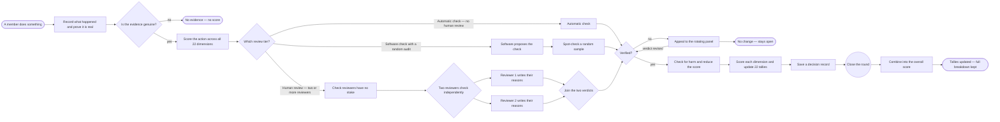

## Aggregation mirror

```mermaid
flowchart LR
  S([Round closed and records settled]) --> F[Fetch each dimension's tally] --> MORE{More dimensions to include?}
  MORE -->|next| F
  MORE -->|done| N[Even out the tallies — blanks stay blank] --> X{Money-driven portion?}
  X -->|yes| EX[Keep money out of voting] --> NJ{Join the tally paths}
  X -->|no| NJ
  NJ --> AUDF{Run both audits in parallel}
  NJ --> BP[Fix systematic under-measurement]
  AUDF --> FA[Fairness audit for care, mediation, upkeep]
  AUDF --> DA[Audit weights for distortion]
  FA --> AJ{Join audit results}
  DA --> AJ
  AJ --> W[Members review and version the weights] --> CV[Save which tuning version was used] --> PJ{Join fixes before combining}
  BP --> PJ
  PJ --> A[Combine into the overall score] --> P{Full breakdown kept?}
  P -->|no| A
  P -->|yes| U{May the score gate access?}
  U -->|scale votes| STOP([Not allowed — scores never scale votes])
  U -->|access and quorum only| PUBF{Publish in parallel}
  PUBF --> PS[Publish the summary]
  PUBF --> KV[Keep the 22-score breakdown]
  PS --> PUBJ{Join publications}
  KV --> PUBJ
  PUBJ --> DONE([Round settled])
```

## Per-dimension mirrors

Mirrors of each dimension model's actual flow: start event → evidence/gate tasks → gateways with branch labels → payment task → explanation record → feed tasks → end events.

### C_0 Fool — Entry

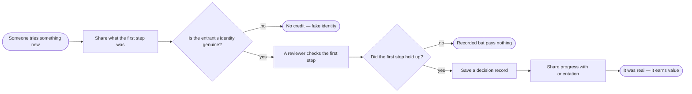

### C_1 Magician — Building

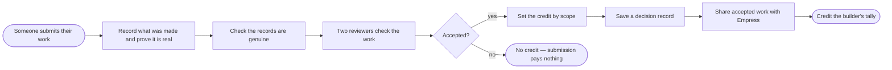

### C_2 Priestess — Recording

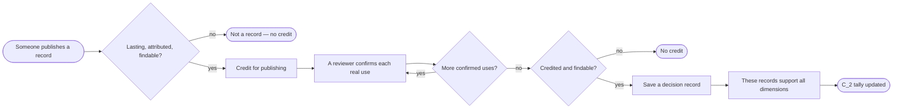

### C_3 Empress — Nurturing

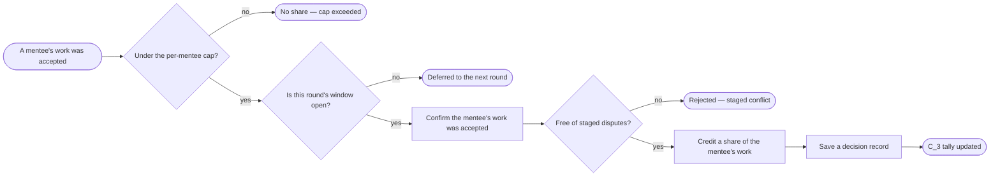

### C_4 Emperor — Rule Changes

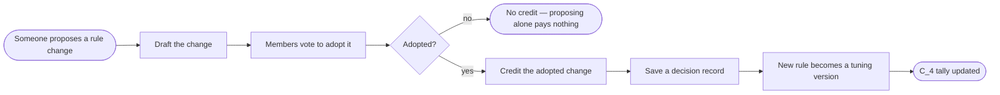

### C_5 Hierophant — Teaching

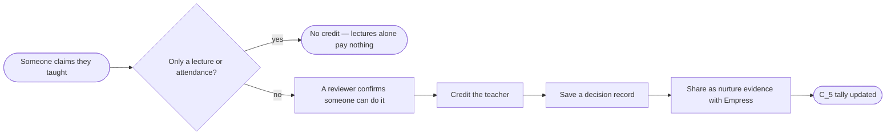

### C_6 Lovers — Joint Builds

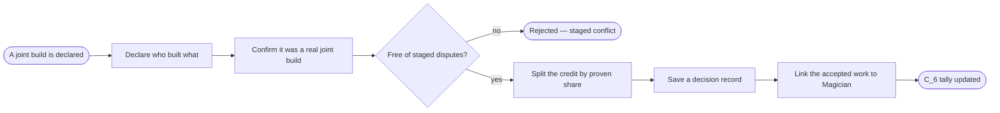

### C_7 Chariot — Milestones

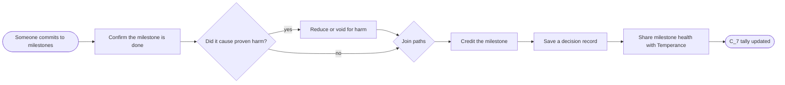

### C_8 Strength — Resolving

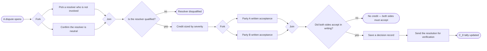

### C_9 Hermit — Discovering

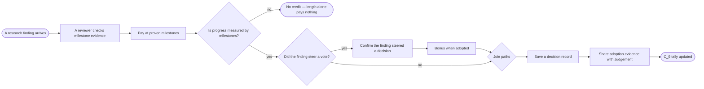

### C_10 Wheel — Fair Cycle Completion

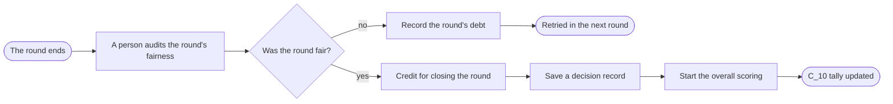

### C_11 Justice — Audits

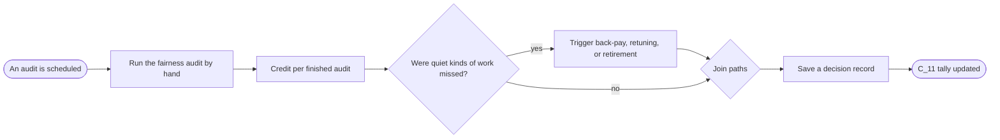

### C_12 Hanged Man — Re-seeing

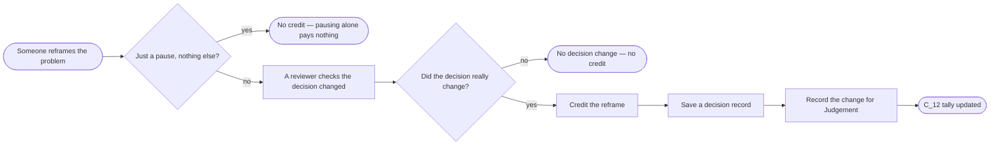

### C_13 Death — Ending

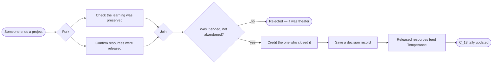

### C_14 Temperance — Health in Range

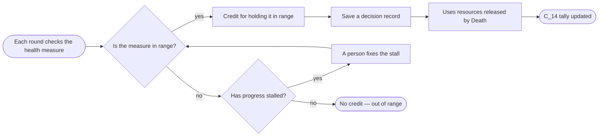

### C_15 Devil — Exposing

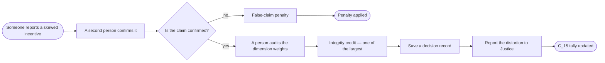

### C_16 Tower — Crisis Response

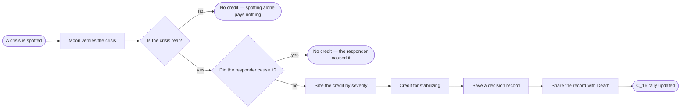

### C_17 Star — Orientation

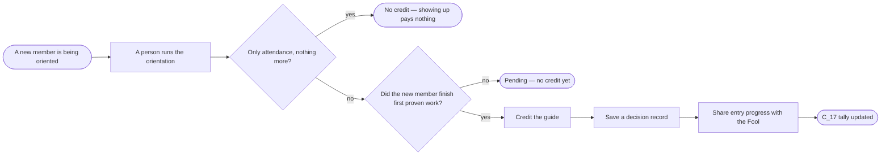

### C_18 Moon — Verifying

```mermaid
flowchart LR
  S([A claim needs checking]) --> G1{More pending claims?}
  G1 -->|no| E1([All claims checked])
  G1 -->|yes| V[Complete verification check] --> T[Credit per finished check] --> ACC[Track accuracy above chance] --> G2{Do reviewers look captured?}
  G2 -->|yes| ROT[Swap in new reviewers] --> G1
  G2 -->|no| RC[Save a decision record] --> F[Verdicts feed all pending claims] --> E2([C_18 tally updated])
```

### C_19 Sun — Public Recognition

```mermaid
flowchart LR
  S([Someone is nominated]) --> G{Tied to a proven record?}
  G -->|no| E1([Rejected — popularity alone pays nothing])
  G -->|yes| RV[A reviewer checks the record] --> C[Credit the recognition] --> RC[Save a decision record] --> F2[Link the recognition to the record] --> E2([C_19 tally updated])
```

### C_20 Judgement — Reckoning

```mermaid
flowchart LR
  S([End-of-round reckoning]) --> PS[People settle the records] --> G{Any unsettled judgments?}
  G -->|yes| KP[Leave open until evidence arrives]
  KP -->|next round| G
  G -->|no| C[Credit the settling] --> RC[Save a decision record] --> FIRE[Mark the records settled] --> E1([C_20 tally updated])
```

### C_21 World — Completion

```mermaid
flowchart LR
  S([Someone claims the whole round is done]) --> V[A person confirms the round completed] --> G{Is every part of the round settled?}
  G -->|no| E1([Incomplete — defer])
  G -->|yes| C[Credit the completion] --> RC[Save a decision record] --> CLOSE[Close the round so scores can be published] --> E2([C_21 tally updated])
```

## Invariants

- Pay on outcome, never on activity (submission, attendance, lecture length, pause duration earn nothing).
  - **In plain terms:** You only get credit when the work produced a verified result — not for showing up.
- Every action is multi-classified into a sparse weighted vector `P(a) = [p_0 … p_21]`.
  - **In plain terms:** One action can count toward several dimensions at once.
- Delta formula: `Delta C_i(a) = Match_i × Outcome × Verification × Calibration_i`; verified harm reduces/voids the outcome beforehand.
  - **In plain terms:** Each dimension's score grows with fit, real-world result, and verification strength, adjusted by the DAO's tuning — harm subtracts first.
- 22 non-transferable balances; `null` (no evidence) never becomes `0` (verified zero); null never decays into zero.
  - **In plain terms:** Scores belong to one person forever, and "no evidence" never quietly becomes a failed score.
- `$RCT = aggregate(alpha_i × N_i(C_i))` is a derived summary; the 22-vector remains the source record. `$RCT` may gate eligibility/quorum but never scales votes.
  - **In plain terms:** The overall score is a summary, not the truth — it can gate access but can never make a vote heavier.
- `$RES` is a separate transferable token paid only when a class-specific outcome rule fires.
  - **In plain terms:** The spendable token pays only on proven results, never for holding or transferring it.
- Voting weight draws only from human-attributed portions of balances in question-declared salient dimensions, with hard caps; capital-derived contribution never becomes voting power.
  - **In plain terms:** Only human work in the dimensions the question cares about affects vote weight — money never does.
- Every decision emits an explanation record (action ID, evidence, dimensions, intensities, calibration version, review decisions, appeal route).
  - **In plain terms:** Every scoring decision can be looked up later and appealed.
- Measurement failure is the system's debt, never the contributor's — chronic under-measurement triggers back-pay, calibration, or rule retirement.
  - **In plain terms:** If the system keeps failing to notice real work, the system owes the fix — not the worker.

## Badge note

The 10 dimensions the source page only names (Chariot, Emperor, Lovers, Wheel, Justice, Temperance, Star, Sun, Judgement, World) are fully modeled here as proposed interpretations pending DAO ratification; the 12 named-and-specified dimensions and 3 core diagrams derive directly from the spec page.