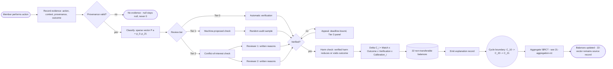
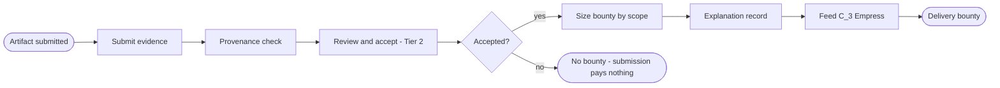

# Contribution Economy BPM Workflows Implementation Plan

> **For agentic workers:** REQUIRED SUB-SKILL: Use superpowers:subagent-driven-development (recommended) or superpowers:executing-plans to implement this plan task-by-task. Steps use checkbox (`- [ ]`) syntax for tracking.

**Goal:** Author 25 BPMN 2.0 diagrams (master lifecycle, 22 dimensions, interaction map, `$RCT` aggregation), a bpmn-js presentation page, and a README with Mermaid mirrors, implementing `docs/superpowers/specs/2026-09-16-contribution-economy-workflows-design.md`.

**Architecture:** Pure documentation artifact under `docs/contribution-economy/`. BPMN 2.0 XML files are the source of truth, rendered in-browser by bpmn-js (CDN, no build step). A Node script validates every `.bpmn` parses as BPMN. Images are generated from bpmn-js via a per-diagram "Download SVG" button — no hand-drawn assets.

**Tech Stack:** BPMN 2.0 XML, bpmn-js 17 (browser viewer), bpmn-moddle (Node validation), Mermaid (GitHub fallback), plain HTML/CSS/JS.

**Important constraints:**
- The repo has unrelated uncommitted changes in `client/` and `server/` — NEVER stage those. Every commit in this plan adds only files under `docs/contribution-economy/` and `.gitignore`.
- Spec invariants checked per diagram (see Task 12 checklist): outcome-only payment, null ≠ 0, human gates present, `$RCT` never scales votes.

---

## File Structure

```
docs/contribution-economy/
├── package.json              ← tooling only (bpmn-moddle)
├── validate.mjs              ← parses every bpmn/*.bpmn with bpmn-moddle, exits 1 on failure
├── index.html                ← bpmn-js presentation page
├── README.md                 ← index, Mermaid mirrors, cross-dependency table
└── bpmn/
    ├── 00-master-lifecycle.bpmn
    ├── 20-interaction-map.bpmn
    ├── 21-aggregation-rct.bpmn
    ├── c00-fool.bpmn        ├── c01-magician.bpmn    ├── c02-priestess.bpmn
    ├── c03-empress.bpmn     ├── c04-emperor.bpmn     ├── c05-hierophant.bpmn
    ├── c06-lovers.bpmn      ├── c07-chariot.bpmn     ├── c08-strength.bpmn
    ├── c09-hermit.bpmn      ├── c10-wheel.bpmn       ├── c11-justice.bpmn
    ├── c12-hanged-man.bpmn  ├── c13-death.bpmn       ├── c14-temperance.bpmn
    ├── c15-devil.bpmn       ├── c16-tower.bpmn       ├── c17-star.bpmn
    ├── c18-moon.bpmn        ├── c19-sun.bpmn         ├── c20-judgement.bpmn
    └── c21-world.bpmn
```

Also modified: `.gitignore` (add `docs/contribution-economy/node_modules/`).

---

## BPMN authoring conventions (used by every task)

- Namespace prefix `bpmn:`, DI elements in `bpmndi:BPMNDiagram`/`BPMNPlane`, bounds via `dc:Bounds`.
- Per-dimension files use 3 horizontal lanes in one pool: **Member** (top), **Human Reviewer / Operator** (middle), **System / Automation** (bottom).
- Coordinate conventions: pool at `x=80, y=80`; lane height 186–188 each; tasks 100×80; gateways 50×50; events 36×36; horizontal spacing ≥ 60px between shapes.
- Every sequence flow gets a `bpmndi:BPMNEdge` with ≥ 2 waypoints; every node a `bpmndi:BPMNShape`.
- Dimension cross-outputs are regular tasks labeled `Feed <target dim>: <what flows>` (message-flow arrows across files are documented in the interaction map + README table instead of cross-file BPMN imports, keeping each file standalone).
- ids: lowercase dimension prefix (`c01_`), descriptive (`c01_task_acceptance`).

---

### Task 1: Scaffold, validation tooling, and the BPMN template (worked example: C_1 Magician)

**Files:**
- Create: `docs/contribution-economy/package.json`
- Create: `docs/contribution-economy/validate.mjs`
- Create: `docs/contribution-economy/bpmn/c01-magician.bpmn`
- Modify: `.gitignore`

- [ ] **Step 1: Create tooling package.json and gitignore entry**

`docs/contribution-economy/package.json`:

```json
{
  "name": "resonantdao-contribution-economy-docs",
  "private": true,
  "description": "Tooling for validating contribution-economy BPMN diagrams",
  "dependencies": {
    "bpmn-moddle": "^11.0.0"
  }
}
```

Add to `.gitignore`:

```
docs/contribution-economy/node_modules/
```

Run: `cd "docs/contribution-economy" && npm install`
Expected: `node_modules/` created, `package-lock.json` present.

- [ ] **Step 2: Write validate.mjs**

```js
import { readFile, readdir } from 'node:fs/promises';
import path from 'node:path';
import { createRequire } from 'node:module';

const require = createRequire(import.meta.url);
const BpmnModdle = require('bpmn-moddle');

const dir = path.join(path.dirname(new URL(import.meta.url).pathname), 'bpmn');
const files = (await readdir(dir)).filter(f => f.endsWith('.bpmn')).sort();

if (files.length === 0) {
  console.error('No .bpmn files found in', dir);
  process.exit(1);
}

let failed = 0;
for (const f of files) {
  try {
    const xml = await readFile(path.join(dir, f), 'utf8');
    const moddle = new BpmnModdle();
    const { rootElement, warnings } = await moddle.fromXML(xml);
    if (!rootElement || rootElement.$type !== 'bpmn:Definitions') {
      throw new Error(`root is ${rootElement && rootElement.$type}, expected bpmn:Definitions`);
    }
    if (warnings && warnings.length) {
      console.warn(`WARN ${f}: ${warnings.map(String).join('; ')}`);
    }
    console.log(`OK   ${f}`);
  } catch (e) {
    console.error(`FAIL ${f}: ${e.message}`);
    failed++;
  }
}
process.exit(failed ? 1 : 0);
```

- [ ] **Step 3: Author the worked-example BPMN: `bpmn/c01-magician.bpmn`**

Complete file (this is the instantiation template for Tasks 2–9):

```xml
<?xml version="1.0" encoding="UTF-8"?>
<bpmn:definitions xmlns:bpmn="http://www.omg.org/spec/BPMN/20100524/MODEL"
                  xmlns:bpmndi="http://www.omg.org/spec/BPMN/20100524/DI"
                  xmlns:dc="http://www.omg.org/spec/DD/20100524/DC"
                  xmlns:di="http://www.omg.org/spec/DD/20100524/DI"
                  id="Definitions_c01" targetNamespace="http://resonantdao.com/bpmn">
  <bpmn:process id="Process_c01" name="C_1 Magician — Building" isExecutable="false">
    <bpmn:laneSet id="LaneSet_c01">
      <bpmn:lane id="c01_lane_member" name="Member">
        <bpmn:flowNodeRef>c01_start</bpmn:flowNodeRef>
        <bpmn:flowNodeRef>c01_task_evidence</bpmn:flowNodeRef>
        <bpmn:flowNodeRef>c01_end_none</bpmn:flowNodeRef>
      </bpmn:lane>
      <bpmn:lane id="c01_lane_reviewer" name="Human Reviewer">
        <bpmn:flowNodeRef>c01_task_acceptance</bpmn:flowNodeRef>
        <bpmn:flowNodeRef>c01_gw_accepted</bpmn:flowNodeRef>
        <bpmn:flowNodeRef>c01_task_scope</bpmn:flowNodeRef>
      </bpmn:lane>
      <bpmn:lane id="c01_lane_system" name="System / Automation">
        <bpmn:flowNodeRef>c01_task_provenance</bpmn:flowNodeRef>
        <bpmn:flowNodeRef>c01_task_record</bpmn:flowNodeRef>
        <bpmn:flowNodeRef>c01_task_feed_c03</bpmn:flowNodeRef>
        <bpmn:flowNodeRef>c01_end_paid</bpmn:flowNodeRef>
      </bpmn:lane>
    </bpmn:laneSet>
    <bpmn:startEvent id="c01_start" name="Artifact submitted"/>
    <bpmn:userTask id="c01_task_evidence" name="Submit evidence: action, context, provenance, outcome"/>
    <bpmn:serviceTask id="c01_task_provenance" name="Provenance check"/>
    <bpmn:userTask id="c01_task_acceptance" name="Review and accept artifact (Tier 2: two independent reviewers)"/>
    <bpmn:exclusiveGateway id="c01_gw_accepted" name="Accepted?"/>
    <bpmn:userTask id="c01_task_scope" name="Size delivery bounty by scope"/>
    <bpmn:endEvent id="c01_end_none" name="No bounty — submission pays nothing"/>
    <bpmn:serviceTask id="c01_task_record" name="Emit explanation record (action ID, dimensions, intensities, calibration version)"/>
    <bpmn:serviceTask id="c01_task_feed_c03" name="Feed C_3 Empress: accepted artifact as mentee-output input"/>
    <bpmn:endEvent id="c01_end_paid" name="Delivery bounty to C_1 balance"/>
    <bpmn:sequenceFlow id="c01_f1" sourceRef="c01_start" targetRef="c01_task_evidence"/>
    <bpmn:sequenceFlow id="c01_f2" sourceRef="c01_task_evidence" targetRef="c01_task_provenance"/>
    <bpmn:sequenceFlow id="c01_f3" sourceRef="c01_task_provenance" targetRef="c01_task_acceptance"/>
    <bpmn:sequenceFlow id="c01_f4" sourceRef="c01_task_acceptance" targetRef="c01_gw_accepted"/>
    <bpmn:sequenceFlow id="c01_f5" name="yes" sourceRef="c01_gw_accepted" targetRef="c01_task_scope"/>
    <bpmn:sequenceFlow id="c01_f6" sourceRef="c01_task_scope" targetRef="c01_task_record"/>
    <bpmn:sequenceFlow id="c01_f7" sourceRef="c01_task_record" targetRef="c01_task_feed_c03"/>
    <bpmn:sequenceFlow id="c01_f8" sourceRef="c01_task_feed_c03" targetRef="c01_end_paid"/>
    <bpmn:sequenceFlow id="c01_f9" name="no" sourceRef="c01_gw_accepted" targetRef="c01_end_none"/>
  </bpmn:process>
  <bpmndi:BPMNDiagram id="Diagram_c01">
    <bpmndi:BPMNPlane id="Plane_c01" bpmnElement="Process_c01">
      <bpmndi:BPMNShape id="c01_pool_di" bpmnElement="Process_c01" isHorizontal="true">
        <dc:Bounds x="80" y="80" width="1160" height="560"/>
      </bpmndi:BPMNShape>
      <bpmndi:BPMNShape id="c01_lane_member_di" bpmnElement="c01_lane_member" isHorizontal="true">
        <dc:Bounds x="110" y="80" width="1130" height="186"/>
      </bpmndi:BPMNShape>
      <bpmndi:BPMNShape id="c01_lane_reviewer_di" bpmnElement="c01_lane_reviewer" isHorizontal="true">
        <dc:Bounds x="110" y="266" width="1130" height="186"/>
      </bpmndi:BPMNShape>
      <bpmndi:BPMNShape id="c01_lane_system_di" bpmnElement="c01_lane_system" isHorizontal="true">
        <dc:Bounds x="110" y="452" width="1130" height="188"/>
      </bpmndi:BPMNShape>
      <bpmndi:BPMNShape id="c01_start_di" bpmnElement="c01_start">
        <dc:Bounds x="150" y="156" width="36" height="36"/>
      </bpmndi:BPMNShape>
      <bpmndi:BPMNShape id="c01_task_evidence_di" bpmnElement="c01_task_evidence">
        <dc:Bounds x="230" y="134" width="100" height="80"/>
      </bpmndi:BPMNShape>
      <bpmndi:BPMNShape id="c01_task_provenance_di" bpmnElement="c01_task_provenance">
        <dc:Bounds x="370" y="320" width="100" height="80"/>
      </bpmndi:BPMNShape>
      <bpmndi:BPMNShape id="c01_task_acceptance_di" bpmnElement="c01_task_acceptance">
        <dc:Bounds x="510" y="320" width="100" height="80"/>
      </bpmndi:BPMNShape>
      <bpmndi:BPMNShape id="c01_gw_accepted_di" bpmnElement="c01_gw_accepted">
        <dc:Bounds x="650" y="335" width="50" height="50"/>
      </bpmndi:BPMNShape>
      <bpmndi:BPMNShape id="c01_task_scope_di" bpmnElement="c01_task_scope">
        <dc:Bounds x="740" y="320" width="100" height="80"/>
      </bpmndi:BPMNShape>
      <bpmndi:BPMNShape id="c01_end_none_di" bpmnElement="c01_end_none">
        <dc:Bounds x="662" y="134" width="36" height="36"/>
      </bpmndi:BPMNShape>
      <bpmndi:BPMNShape id="c01_task_record_di" bpmnElement="c01_task_record">
        <dc:Bounds x="890" y="320" width="100" height="80"/>
      </bpmndi:BPMNShape>
      <bpmndi:BPMNShape id="c01_task_feed_c03_di" bpmnElement="c01_task_feed_c03">
        <dc:Bounds x="1020" y="320" width="100" height="80"/>
      </bpmndi:BPMNShape>
      <bpmndi:BPMNShape id="c01_end_paid_di" bpmnElement="c01_end_paid">
        <dc:Bounds x="1050" y="156" width="36" height="36"/>
      </bpmndi:BPMNShape>
      <bpmndi:BPMNEdge id="c01_f1_di" bpmnElement="c01_f1">
        <di:waypoint x="186" y="174"/><di:waypoint x="230" y="174"/>
      </bpmndi:BPMNEdge>
      <bpmndi:BPMNEdge id="c01_f2_di" bpmnElement="c01_f2">
        <di:waypoint x="280" y="214"/><di:waypoint x="420" y="214"/><di:waypoint x="420" y="320"/>
      </bpmndi:BPMNEdge>
      <bpmndi:BPMNEdge id="c01_f3_di" bpmnElement="c01_f3">
        <di:waypoint x="470" y="360"/><di:waypoint x="510" y="360"/>
      </bpmndi:BPMNEdge>
      <bpmndi:BPMNEdge id="c01_f4_di" bpmnElement="c01_f4">
        <di:waypoint x="610" y="360"/><di:waypoint x="650" y="360"/>
      </bpmndi:BPMNEdge>
      <bpmndi:BPMNEdge id="c01_f5_di" bpmnElement="c01_f5">
        <di:waypoint x="700" y="360"/><di:waypoint x="740" y="360"/>
      </bpmndi:BPMNEdge>
      <bpmndi:BPMNEdge id="c01_f6_di" bpmnElement="c01_f6">
        <di:waypoint x="840" y="360"/><di:waypoint x="890" y="360"/>
      </bpmndi:BPMNEdge>
      <bpmndi:BPMNEdge id="c01_f7_di" bpmnElement="c01_f7">
        <di:waypoint x="990" y="360"/><di:waypoint x="1040" y="360"/>
      </bpmndi:BPMNEdge>
      <bpmndi:BPMNEdge id="c01_f8_di" bpmnElement="c01_f8">
        <di:waypoint x="1120" y="360"/><di:waypoint x="1120" y="174"/><di:waypoint x="1092" y="174"/>
      </bpmndi:BPMNEdge>
      <bpmndi:BPMNEdge id="c01_f9_di" bpmnElement="c01_f9">
        <di:waypoint x="675" y="335"/><di:waypoint x="675" y="170"/><di:waypoint x="662" y="160"/>
      </bpmndi:BPMNEdge>
    </bpmndi:BPMNPlane>
  </bpmndi:BPMNDiagram>
</bpmn:definitions>
```

- [ ] **Step 4: Validate**

Run: `cd "docs/contribution-economy" && node validate.mjs`
Expected: `OK   c01-magician.bpmn` (exit 0). If bpmn-moddle reports DI warnings, fix coordinates/refs until clean.

- [ ] **Step 5: Visual smoke check (optional at this stage, required in Task 12)**

Open `index.html` doesn't exist yet — defer. Validate only.

- [ ] **Step 6: Commit**

```bash
git add docs/contribution-economy/package.json docs/contribution-economy/package-lock.json docs/contribution-economy/validate.mjs docs/contribution-economy/bpmn/c01-magician.bpmn .gitignore
git commit -m "docs(contribution-economy): scaffold tooling and BPMN template (C_1 Magician)"
```

---

### Task 2: Master lifecycle BPMN (`bpmn/00-master-lifecycle.bpmn`)

**Files:**
- Create: `docs/contribution-economy/bpmn/00-master-lifecycle.bpmn`

**Content spec (all elements required):**

Lanes (6): `ml_lane_member` Member | `ml_lane_evidence` Evidence Layer | `ml_lane_classifier` Classifier | `ml_lane_verification` Verification | `ml_lane_balance` Balance Engine | `ml_lane_cycle` Cycle Operators.

Nodes/flows:
1. `ml_start` startEvent "Member performs action" (Member)
2. `ml_task_evidence` userTask "Record evidence: action, context, provenance, outcome (C_2 rails)" (Evidence)
3. `ml_gw_provenance` exclusiveGateway "Provenance valid?" (Evidence) — no → `ml_end_rejected` "No evidence — null stays null (never 0)" (Evidence)
4. `ml_task_classify` serviceTask "Classify: propose sparse vector P(a) = [p_0 … p_21]" (Classifier)
5. `ml_gw_tier` exclusiveGateway "Review tier" (Verification) with three outgoing: Tier 0 / Tier 1 / Tier 2+
6. Tier 0: `ml_task_t0` serviceTask "Automatic verification" (Verification)
7. Tier 1: `ml_task_t1` serviceTask "Machine-proposed check" → `ml_task_t1_audit` userTask "Random audit sample" (Verification)
8. Tier 2: `ml_task_t2_conflict` userTask "Conflict-of-interest check" → two parallel `userTask`s "Reviewer 1: written reasons" and "Reviewer 2: written reasons" (Verification; parallel gateway pair)
9. `ml_gw_verdict` exclusiveGateway "Verified?" — no → `ml_task_appeal` userTask "Appeal (deadline-bound, Tier 3 rotating panel)" (Verification) → back into `ml_gw_verdict` via "verdict revised" flow; still-no → `ml_end_unverified` "Unverified — no delta, judgment stays pending (settles retroactively)"
10. `ml_task_harm` serviceTask "Harm check — verified harm reduces or voids outcome" (Balance)
11. `ml_task_delta` serviceTask "Delta C_i(a) = Match_i × Outcome × Verification × Calibration_i → 22 non-transferable balances" (Balance)
12. `ml_task_record` serviceTask "Emit explanation record" (Balance)
13. `ml_event_cycle` intermediateEvent (none) "Cycle boundary (C_10 Wheel → C_20 Judgement → C_21 World)" (Cycle)
14. `ml_task_rct` serviceTask "Aggregate $RCT (see 21-aggregation-rct.bpmn)" (Cycle)
15. `ml_end` endEvent "Balances updated — 22-vector remains source record" (Cycle)

- [ ] **Step 1: Author `bpmn/00-master-lifecycle.bpmn`** using the Task 1 template structure (definitions/process/laneSet/DI skeleton, ids prefixed `ml_`, conventions from "BPMN authoring conventions"). Pool width ~1500, 6 lanes of height ~150 (total ~900).
- [ ] **Step 2: Validate** — `cd "docs/contribution-economy" && node validate.mjs` → expect `OK   00-master-lifecycle.bpmn` and `OK   c01-magician.bpmn`, exit 0.
- [ ] **Step 3: Commit**

```bash
git add docs/contribution-economy/bpmn/00-master-lifecycle.bpmn
git commit -m "docs(contribution-economy): master contribution lifecycle BPMN"
```

---

### Task 3: $RCT aggregation BPMN (`bpmn/21-aggregation-rct.bpmn`)

**Files:**
- Create: `docs/contribution-economy/bpmn/21-aggregation-rct.bpmn`

**Content spec:**

Lanes (4): `rct_lane_balance` Balance Engine | `rct_lane_norm` Normalization | `rct_lane_gov` Governance (human) | `rct_lane_pub` Publication.

Nodes/flows:
1. `rct_start` startEvent (none) "Cycle boundary — C_10 Wheel fair close + C_20 Judgement provenance settled" (Balance)
2. Loop (0–21, model one iteration with a `task` "Fetch C_i balances" + `exclusiveGateway` "More dimensions?" loop-back labeled "next i" for i=0..21) (Balance)
3. `rct_task_norm` serviceTask "Normalize N_i(C_i) — null-preserving: null stays null, never becomes 0, never decays" (Norm)
4. `rct_gw_exclusion` exclusiveGateway "Capital-derived portion?" — yes → `rct_task_exclude` serviceTask "Exclude from voting-relevant aggregation (capital never becomes voting power)" (Norm); no → skip
5. `rct_gov_audit` userTask "Governance review of alpha_i weights + versioning" (Governance), with two precondition annotations:
   - `rct_task_fairness` userTask "C_11 Justice fairness audit: under-recognized care / mediation / maintenance" (Governance)
   - `rct_task_devil` userTask "C_15 Devil distortion audit of dimension weights" (Governance)
   - Weight change → `rct_task_calib` serviceTask "Emit calibration-version explanation record"
6. `rct_gov_backpay` userTask "Chronic under-measurement check → back-pay / calibration / rule retirement" (Governance) — parallel path from normalization loop
7. `rct_task_aggregate` serviceTask "RCT = aggregate(alpha_i × N_i(C_i))" (Norm)
8. `rct_gw_preserve` exclusiveGateway "Profile preserved (RCT summarizes, never erases 22-vector)?" — no → back to aggregation
9. `rct_gw_use` exclusiveGateway "Use gate: eligibility/quorum only" — any path labeled "scale voting weight" is FORBIDDEN; model the only outgoing as "gate eligibility/quorum (human-attributed portions in salient dimensions, hard caps)"
10. `rct_task_publish` serviceTask "Publish summary" + `rct_task_source` serviceTask "Update 22-vector as source record" (parallel gateway join) → `rct_end` endEvent "Cycle settled" (Publication)

- [ ] **Step 1: Author the file** (ids prefixed `rct_`, template conventions apply).
- [ ] **Step 2: Validate** → expect `OK   21-aggregation-rct.bpmn`.
- [ ] **Step 3: Commit**

```bash
git add docs/contribution-economy/bpmn/21-aggregation-rct.bpmn
git commit -m "docs(contribution-economy): \$RCT aggregation workflow BPMN"
```

---

### Task 4: Interaction map BPMN (`bpmn/20-interaction-map.bpmn`)

**Files:**
- Create: `docs/contribution-economy/bpmn/20-interaction-map.bpmn`

**Content spec:** a non-executable process laid out in 3 horizontal bands (modeled as 3 lanes). Nodes are `task`s (one per dimension, label `C_<n> <Name>`) and `sequenceFlow`s are the cross-dimension dependencies below. This is a dependency diagram rendered in BPMN form, not a procedural flow.

Lanes: `im_lane_rails` "Rails (serve everyone)" | `im_lane_flows` "Flow dependencies" | `im_lane_cycle` "Cycle spine".

Rails lane (tasks): C_2 Priestess, C_18 Moon, C_4 Emperor, C_11 Justice, C_15 Devil.
Flows lane (tasks): C_0 Fool, C_1 Magician, C_3 Empress, C_5 Hierophant, C_9 Hermit, C_12 Hanged Man, C_13 Death, C_16 Tower, C_17 Star.
Cycle spine lane (tasks): C_10 Wheel → C_20 Judgement → C_21 World → `task` "21-aggregation-rct.bpmn"; plus C_14 Temperance, C_19 Sun.

Required dependency flows (labels describe what flows):
1. C_2 → C_0, C_2 → C_1, C_2 → C_5, C_2 → C_9, C_2 → C_19 "evidence records"
2. C_18 → C_16 "crisis verification verdict" (Tower requires verified crisis); C_18 → C_8 "verification of resolution acceptance"; C_18 → C_13 "verify resource release"
3. C_1 → C_3 "mentee's accepted artifact = multiplier input"
4. C_5 → C_3 "demonstrated competence = nurture evidence"
5. C_9 → C_20 "decision-steering evidence (adoption bonus)"
6. C_12 → C_20 "decision-changed evidence"
7. C_13 → C_14 "released resources feed health metric"
8. C_17 → C_0 "orientation feeds entry"; C_17 → C_1 "orientee's first verified contribution"
9. C_15 → C_11 "weight distortion findings"; C_15 → aggregation node "distortion audit precondition"
10. C_11 → aggregation node "calibration updates + fairness audit"
11. C_10 → C_20 "fair cycle close"; C_20 → C_21 "provenance settled"; C_21 → aggregation node "whole-cycle completion"
12. C_4 → aggregation node "adopted rules / calibration versions"
13. C_19 → C_2 "recognition must tie to verified record"
14. C_16 → C_13 "crisis stabilization feeds clean closure decisions" — only if defensible from spec; otherwise omit. Rule: include a flow only if the spec table in the design doc lists it; the canonical list is the 13 entries above.

- [ ] **Step 1: Author the file** (ids prefixed `im_`, 3 lanes, tasks 120×80).
- [ ] **Step 2: Validate** → `OK   20-interaction-map.bpmn`.
- [ ] **Step 3: Commit**

```bash
git add docs/contribution-economy/bpmn/20-interaction-map.bpmn
git commit -m "docs(contribution-economy): dimension interaction map BPMN"
```

---

### Task 5: Specified dimensions batch 1 — C_0 Fool, C_2 Priestess, C_3 Empress, C_5 Hierophant

**Files (create):**
- `docs/contribution-economy/bpmn/c00-fool.bpmn`
- `docs/contribution-economy/bpmn/c02-priestess.bpmn`
- `docs/contribution-economy/bpmn/c03-empress.bpmn`
- `docs/contribution-economy/bpmn/c05-hierophant.bpmn`

(C_1 exists from Task 1.)

**Per-file content spec — each file follows the Task 1 template exactly (same lane structure; ids prefixed `c00_`/`c02_`/`c03_`/`c05_`; every file has: start event, evidence task, human gate(s) as userTask, payment gateway, anti-gaming gateway, explanation-record task, feed task(s), two end events):**

**c00-fool.bpmn:**
- Start: "Entry action into unworked territory"
- Evidence: "Submit entry evidence"
- Anti-gaming gateway "Sybil check passed?" (System lane) — no → End "No entry credit (Sybil)"
- Gateway "Crossing validated?" — human userTask "Validate crossing (reviewer)" — no → End "Entry event = verified zero (recorded, no payment)"
- Yes → End "Validated crossing earns non-zero value"
- Feed task: "Feed C_17 Star: orientation progress"

**c02-priestess.bpmn:**
- Start: "Record published"
- Evidence: "Verify durable, attributable, findable" (gateway, no → End "Not a record — no credit")
- Payment: serviceTask "Base credit on publication"
- Human gate: userTask "Verify retrieval (usage bonus per verified retrieval)" (loop: more retrievals? → loop-back)
- Anti-gaming gateway "Attributable and findable?" — no → End "No credit"
- Feed tasks: "Rails for all dimensions: evidence records" → End "C_2 balance updated"

**c03-empress.bpmn:**
- Start: "Mentee's accepted output (from C_1)"
- Gateway "Cap per mentee respected?" — no → End "No multiplier (cap exceeded)"
- Gateway "Cycle gate open?" — no → End "Deferred to next cycle"
- Human gate: userTask "Verify mentee output acceptance"
- Payment: serviceTask "Nurture multiplier: percentage of mentee's accepted output"
- Anti-gaming: gateway "Conflict-farming check passed?"
- Feed: "Balance delta to C_3" → End

**c05-hierophant.bpmn:**
- Start: "Teaching claimed"
- Anti-gaming gateway "Pays on demonstrated competence only — lecture/attendance rejected?" (explicit gateway labeled "Lecture or attendance only? yes → End 'No credit'")
- Human gate: userTask "Review demonstrated competence in another member"
- Payment: serviceTask "Competence credit"
- Feed: "Feed C_3 Empress: competence as nurture evidence" → End

- [ ] **Step 1: Author the 4 files.**
- [ ] **Step 2: Validate** — `node validate.mjs` shows all 4 new files `OK`.
- [ ] **Step 3: Commit**

```bash
git add docs/contribution-economy/bpmn/c00-fool.bpmn docs/contribution-economy/bpmn/c02-priestess.bpmn docs/contribution-economy/bpmn/c03-empress.bpmn docs/contribution-economy/bpmn/c05-hierophant.bpmn
git commit -m "docs(contribution-economy): dimension workflows C_0, C_2, C_3, C_5"
```

---

### Task 6: Specified dimensions batch 2 — C_8 Strength, C_9 Hermit, C_12 Hanged Man, C_13 Death

**Files (create):** `bpmn/c08-strength.bpmn`, `bpmn/c09-hermit.bpmn`, `bpmn/c12-hanged-man.bpmn`, `bpmn/c13-death.bpmn`

**Content spec:**

**c08-strength.bpmn:**
- Start: "Live dispute opened"
- Human gate (parallel gateway pair): userTask "Assign non-party resolver" + userTask "Verify resolver is not a party" (anti-gaming; fail → End "Resolver disqualified")
- Payment: serviceTask "Resolution token sized by severity"
- Human gate (parallel gateway pair): userTask "Party A written acceptance" + userTask "Party B written acceptance" — parallel join; either rejects → End "No resolution token (both acceptances required)"
- Feed: "Feed C_18 Moon: resolution record for verification" → End "C_8 balance updated"

**c09-hermit.bpmn:**
- Start: "Research finding delivered"
- Human gate: userTask "Milestone evidence review"
- Payment: serviceTask "Deep-work bounty at milestones"
- Anti-gaming gateway "Payment trigger = milestone (not length)?" — no → End "No bounty"
- Conditional path: gateway "Finding steers a vote?" — yes → userTask "Verify decision-steering evidence" → serviceTask "Adoption bonus" → join
- Feed: "Feed C_20 Judgement: adoption evidence" → End

**c12-hanged-man.bpmn:**
- Start: "Reframe proposed"
- Anti-gaming gateway "Pause duration measured? (pays on decision-changed, never on pause)" — reject pause-only
- Human gate: userTask "Review decision-delta evidence"
- Payment: serviceTask "Decision-changed credit"
- Feed: "Feed C_20 Judgement: decision-change record" → End

**c13-death.bpmn:**
- Start: "Closure chosen"
- Human gate (parallel pair): userTask "Review preserved learning" + userTask "Verify resource release"
- Anti-gaming gateway "Closure theater check (real closure, not abandonment)?"
- Payment: serviceTask "Closure token"
- Feed: "Feed C_14 Temperance: released resources" → End

- [ ] **Step 1: Author the 4 files.**
- [ ] **Step 2: Validate** — all new files `OK`.
- [ ] **Step 3: Commit**

```bash
git add docs/contribution-economy/bpmn/c08-strength.bpmn docs/contribution-economy/bpmn/c09-hermit.bpmn docs/contribution-economy/bpmn/c12-hanged-man.bpmn docs/contribution-economy/bpmn/c13-death.bpmn
git commit -m "docs(contribution-economy): dimension workflows C_8, C_9, C_12, C_13"
```

---

### Task 7: Specified dimensions batch 3 — C_15 Devil, C_16 Tower, C_18 Moon

**Files (create):** `bpmn/c15-devil.bpmn`, `bpmn/c16-tower.bpmn`, `bpmn/c18-moon.bpmn`

**Content spec:**

**c15-devil.bpmn:**
- Start: "Incentive distortion claim filed"
- Human gate: userTask "Corroboration by independent member (≥ 1)"
- Gateway "Claim corroborated?" — no → serviceTask "False-claim penalty" → End "Penalty applied"
- Human gate: userTask "Devil operator audit of weights (human-only during bootstrap)"
- Payment: serviceTask "Integrity bounty (among the largest payouts)"
- Feed: "Feed C_11 Justice + aggregation: distortion finding" → End "C_15 balance updated"

**c16-tower.bpmn:**
- Start: "Crisis event detected"
- Human gate: userTask "Verify crisis via C_18 Moon" — not verified → End "No token (detection alone pays nothing)"
- Anti-gaming gateway "Caused by responder's own failure?" — yes → End "No token"
- Human gate: userTask "Size token by severity"
- Payment: serviceTask "Crisis token for stabilization"
- Feed: "Feed C_13 Death: stabilization record" → End

**c18-moon.bpmn:**
- Start: "Pending claim enqueued"
- Loop gateway "More pending claims?"
- Human gate: userTask "Complete verification check"
- Payment: serviceTask "Verification token per completed check (regardless of direction)"
- System: serviceTask "Track accuracy vs chance"
- Gateway "Reviewer capture suspected?" — yes → userTask "Rotate reviewer pool (Tier 3)" → back to loop
- Feed: "Verdicts feed all dimensions' pending claims" → End

- [ ] **Step 1: Author the 3 files.**
- [ ] **Step 2: Validate.**
- [ ] **Step 3: Commit**

```bash
git add docs/contribution-economy/bpmn/c15-devil.bpmn docs/contribution-economy/bpmn/c16-tower.bpmn docs/contribution-economy/bpmn/c18-moon.bpmn
git commit -m "docs(contribution-economy): dimension workflows C_15, C_16, C_18"
```

---

### Task 8: Extrapolated dimensions batch 1 — C_4 Emperor, C_6 Lovers, C_7 Chariot, C_10 Wheel, C_11 Justice

All five files get the standard 3-lane skeleton; content proposed from spec logic (the HTML page in Task 10 badges these as *proposed interpretation*).

**Files (create):** `bpmn/c04-emperor.bpmn`, `bpmn/c06-lovers.bpmn`, `bpmn/c07-chariot.bpmn`, `bpmn/c10-wheel.bpmn`, `bpmn/c11-justice.bpmn`

**Content spec:**

**c04-emperor.bpmn:**
- Start: "Rule change proposed" → userTask "Draft rule change" (Member)
- Human gate: userTask "Ratification vote" (Governance) — rejected → End "No bounty (proposal alone pays nothing)"
- Payment: serviceTask "Governance bounty on adopted change"
- Feed: "Feed aggregation: adopted rule → calibration parameter version" → End

**c06-lovers.bpmn:**
- Start: "Joint build declared" → userTask "Declare joint build with attribution shares"
- Human gate: userTask "Review genuine joint contribution + verified attribution"
- Anti-gaming gateway "Conflict farming check passed?"
- Payment: serviceTask "Shared delivery bounty split by verified attribution"
- Feed: "Feed C_1: joint artifact acceptance" → End

**c07-chariot.bpmn:**
- Start: "Milestone plan committed" → human gate userTask "Verify milestone completion"
- Gateway "Harm detected (verified)?" — yes → serviceTask "Net-of-harm adjustment (reduce/void outcome)"
- Payment: serviceTask "Milestone token"
- Feed: "Feed C_14 Temperance: milestone health context" → End

**c10-wheel.bpmn:**
- Start: "Cycle end reached" → userTask "Fairness audit of cycle (human)" 
- Gateway "Cycle fair?" — no → serviceTask "Log cycle debt — measurement failure is the system's debt" → End "Retrial next cycle"
- Payment: serviceTask "Cycle-completion credit" → serviceTask "Fire cycle-boundary event (to 21-aggregation-rct.bpmn)" → End

**c11-justice.bpmn:**
- Start: "Audit scheduled" → userTask "Execute fairness audit (human-only during bootstrap)"
- Payment: serviceTask "Audit token per completed audit"
- Gateway "Under-recognition found (care / mediation / maintenance)?" — yes → serviceTask "Trigger back-pay / calibration / rule retirement"
- Feed: "Feed aggregation: calibration updates" → End

- [ ] **Step 1: Author the 5 files.**
- [ ] **Step 2: Validate.**
- [ ] **Step 3: Commit**

```bash
git add docs/contribution-economy/bpmn/c04-emperor.bpmn docs/contribution-economy/bpmn/c06-lovers.bpmn docs/contribution-economy/bpmn/c07-chariot.bpmn docs/contribution-economy/bpmn/c10-wheel.bpmn docs/contribution-economy/bpmn/c11-justice.bpmn
git commit -m "docs(contribution-economy): proposed dimension workflows C_4, C_6, C_7, C_10, C_11"
```

---

### Task 9: Extrapolated dimensions batch 2 — C_14 Temperance, C_17 Star, C_19 Sun, C_20 Judgement, C_21 World

**Files (create):** `bpmn/c14-temperance.bpmn`, `bpmn/c17-star.bpmn`, `bpmn/c19-sun.bpmn`, `bpmn/c20-judgement.bpmn`, `bpmn/c21-world.bpmn`

**Content spec:**

**c14-temperance.bpmn:**
- Start: "Health metric monitoring cycle"
- Gateway "Metric in range?" — yes → serviceTask "Holding credit per in-range interval"
- No → gateway "Stall detected?" — yes → userTask "Stall remediation (human)" → back to monitor; no → End "No credit (out of range)"
- Feed: "Consumes resources released by C_13 Death" → End

**c17-star.bpmn:**
- Start: "New member oriented" → userTask "Orientation session (human)"
- Anti-gaming gateway "Attendance only? (pays nothing until contribution)"
- Gateway "Orientee completed first verified contribution?" — no → End "Pending (no credit yet)"
- Payment: serviceTask "Onboarding credit"
- Feed: "Feed C_0 Fool: entry progress" → End

**c19-sun.bpmn:**
- Start: "Recognition nomination"
- Gateway "Tied to verified record?" — no → End "Rejected (popularity alone pays nothing)"
- Human gate: userTask "Recognition review"
- Payment: serviceTask "Recognition credit"
- Feed: "Feed C_2 Priestess: recognized record link" → End

**c20-judgement.bpmn:**
- Start: "Cycle reckoning" → userTask "Provenance settlement (human-only during bootstrap)"
- Gateway "Unresolved judgments?" — yes → serviceTask "Keep pending — settles retroactively when evidence arrives" (loop back next cycle)
- Payment: serviceTask "Reckoning credit" → serviceTask "Fire aggregation precondition (provenance settled)" → End

**c21-world.bpmn:**
- Start: "Whole-cycle completion claimed" → userTask "Verify completion of the whole (human)"
- Gateway "All cycle dimensions settled?" — no → End "Incomplete — defer"
- Payment: serviceTask "Completion credit" → serviceTask "Close cycle spine — enable $RCT publication" → End

- [ ] **Step 1: Author the 5 files.**
- [ ] **Step 2: Validate** — expect all 25 `.bpmn` files `OK`, exit 0.
- [ ] **Step 3: Commit**

```bash
git add docs/contribution-economy/bpmn/c14-temperance.bpmn docs/contribution-economy/bpmn/c17-star.bpmn docs/contribution-economy/bpmn/c19-sun.bpmn docs/contribution-economy/bpmn/c20-judgement.bpmn docs/contribution-economy/bpmn/c21-world.bpmn
git commit -m "docs(contribution-economy): proposed dimension workflows C_14, C_17, C_19, C_20, C_21"
```

---

### Task 10: Presentation page (`index.html`)

**Files:**
- Create: `docs/contribution-economy/index.html`

- [ ] **Step 1: Write `index.html`** — complete file:

```html
<!doctype html>
<html lang="en">
<head>
<meta charset="utf-8"/>
<meta name="viewport" content="width=device-width, initial-scale=1"/>
<title>ResonantDAO — Contribution Economy Workflows</title>
<style>
  body { font-family: system-ui, sans-serif; margin: 0; background: #14181d; color: #e6e6e6; }
  header { padding: 24px 32px; border-bottom: 1px solid #2a3138; }
  h1 { font-size: 22px; margin: 0; }
  header p { color: #9aa7b1; margin: 8px 0 0; max-width: 70em; }
  nav { display: flex; flex-wrap: wrap; gap: 8px; padding: 16px 32px; position: sticky; top: 0;
        background: #14181d; border-bottom: 1px solid #2a3138; z-index: 10; }
  nav a { color: #7fb4d6; text-decoration: none; font-size: 13px; padding: 4px 8px; border-radius: 4px; }
  nav a:hover { background: #232a31; }
  .card { margin: 32px; padding: 20px; background: #1b2128; border: 1px solid #2a3138; border-radius: 8px; }
  .card h2 { font-size: 17px; margin: 0 0 4px; }
  .badge { font-size: 11px; padding: 2px 8px; border-radius: 10px; vertical-align: middle; }
  .badge.specified { background: #1d4028; color: #7fd694; }
  .badge.proposed { background: #4a3a12; color: #e6c25a; }
  .badge.core { background: #1d3550; color: #7fb4d6; }
  .desc { color: #9aa7b1; font-size: 14px; margin: 8px 0; }
  .canvas { height: 420px; border: 1px solid #2a3138; border-radius: 4px; background: #fff; }
  .humans { font-size: 13px; margin: 10px 0 0; }
  .humans b { color: #d0b26a; }
  .actions { margin-top: 8px; }
  button { background: #2a4a66; color: #fff; border: 0; border-radius: 4px; padding: 6px 12px;
           font-size: 13px; cursor: pointer; }
  button:hover { background: #35597a; }
</style>
</head>
<body>
<header>
  <h1>ResonantDAO — Contribution Economy Workflows (v2)</h1>
  <p>22 contribution dimensions (Major Arcana, C_0–C_21) modeled as BPMN 2.0. Key invariants:
     pay on outcome, never on activity; every action is multi-classified;
     Delta C_i = Match × Outcome × Verification × Calibration; null never becomes 0;
     $RCT summarizes the profile but never erases it and never scales votes.</p>
</header>
<nav id="nav"></nav>
<main id="cards"></main>
<script src="https://unpkg.com/bpmn-js@17.9.5/dist/bpmn-navigated-viewer.development.js"></script>
<script>
const CORE = [
  { file: 'bpmn/00-master-lifecycle.bpmn', title: 'Master Contribution Lifecycle', badge: 'core',
    desc: 'Action → evidence → classification P(a) → tiered verification (T0–T3) → harm check → delta formula → 22 balances → cycle boundary → $RCT aggregation.',
    humans: ['Random audit (T1)', 'Two independent reviewers with written reasons (T2)', 'Appeal panel (T3, deadline-bound)'] },
  { file: 'bpmn/20-interaction-map.bpmn', title: 'Dimension Interaction Map', badge: 'core',
    desc: 'Rails (C_2 records, C_18 verification, C_4 rules, C_11 audits, C_15 distortion audits) + cross-dimension flow dependencies + cycle spine C_10 → C_20 → C_21 → aggregation.',
    humans: [] },
  { file: 'bpmn/21-aggregation-rct.bpmn', title: '$RCT Aggregation Workflow', badge: 'core',
    desc: 'Cycle boundary → null-preserving normalization N_i → capital-portion exclusion → human governance of alpha_i (Justice fairness audit + Devil distortion audit) → aggregate → use gate (eligibility/quorum only, never vote scaling) → publish + update 22-vector.',
    humans: ['alpha_i weight review and versioning (Governance)', 'C_11 fairness audit', 'C_15 distortion audit', 'Chronic under-measurement back-pay decision'] },
];
const DIMS = [
  { file: 'bpmn/c00-fool.bpmn', n: 'C_0', title: 'Fool — Entry', badge: 'specified',
    desc: 'Entry/pioneering step. Entry event is a verified zero; validated crossings earn non-zero value.',
    humans: ['Validate crossing (reviewer)', 'Sybil check'] },
  { file: 'bpmn/c01-magician.bpmn', n: 'C_1', title: 'Magician — Building', badge: 'specified',
    desc: 'Delivery bounty on acceptance, sized by scope; never on submission.',
    humans: ['Artifact acceptance review (Tier 2)'] },
  { file: 'bpmn/c02-priestess.bpmn', n: 'C_2', title: 'Priestess — Recording', badge: 'specified',
    desc: 'Base credit on publication + usage bonus per verified retrieval. Evidence rails for all dimensions.',
    humans: ['Retrieval verification'] },
  { file: 'bpmn/c03-empress.bpmn', n: 'C_3', title: 'Empress — Nurturing', badge: 'specified',
    desc: 'Multiplier: percentage of mentee’s accepted output, capped per mentee, cycle-gated.',
    humans: ['Verify mentee output acceptance'] },
  { file: 'bpmn/c04-emperor.bpmn', n: 'C_4', title: 'Emperor — Rule Changes', badge: 'proposed',
    desc: 'Governance bounty on adopted rule change after ratification vote; proposal alone pays nothing.',
    humans: ['Ratification vote'] },
  { file: 'bpmn/c05-hierophant.bpmn', n: 'C_5', title: 'Hierophant — Teaching', badge: 'specified',
    desc: 'Pays on demonstrated competence in another member; lectures and attendance pay nothing.',
    humans: ['Competence demonstration review'] },
  { file: 'bpmn/c06-lovers.bpmn', n: 'C_6', title: 'Lovers — Joint Builds', badge: 'proposed',
    desc: 'Shared delivery bounty on accepted joint artifact, split by verified attribution.',
    humans: ['Joint attribution review'] },
  { file: 'bpmn/c07-chariot.bpmn', n: 'C_7', title: 'Chariot — Milestones', badge: 'proposed',
    desc: 'Milestone token on verified milestone, net-of-harm.',
    humans: ['Milestone verification'] },
  { file: 'bpmn/c08-strength.bpmn', n: 'C_8', title: 'Strength — Resolving', badge: 'specified',
    desc: 'Resolution token sized by severity; requires non-party resolver and both parties’ written acceptance.',
    humans: ['Non-party resolver assignment', 'Party A written acceptance', 'Party B written acceptance'] },
  { file: 'bpmn/c09-hermit.bpmn', n: 'C_9', title: 'Hermit — Discovering', badge: 'specified',
    desc: 'Deep-work bounty at milestones + adoption bonus when a finding steers a vote; never on length.',
    humans: ['Milestone evidence review', 'Decision-steering verification'] },
  { file: 'bpmn/c10-wheel.bpmn', n: 'C_10', title: 'Wheel — Fair Cycle Completion', badge: 'proposed',
    desc: 'Cycle-completion credit on audited fair cycle close; fires the aggregation boundary event.',
    humans: ['Cycle fairness audit'] },
  { file: 'bpmn/c11-justice.bpmn', n: 'C_11', title: 'Justice — Audits / Calibration', badge: 'proposed',
    desc: 'Audit token per completed fairness audit; human-only during bootstrap; triggers back-pay/calibration on under-recognition.',
    humans: ['Execute fairness audit (human-only bootstrap)'] },
  { file: 'bpmn/c12-hanged-man.bpmn', n: 'C_12', title: 'Hanged Man — Re-seeing', badge: 'specified',
    desc: 'Pays on decision-changed; never on pause duration.',
    humans: ['Decision-delta evidence review'] },
  { file: 'bpmn/c13-death.bpmn', n: 'C_13', title: 'Death — Ending', badge: 'specified',
    desc: 'Closure token requiring preserved learning and verified resource release; feeds C_14.',
    humans: ['Preserved-learning review', 'Resource release verification'] },
  { file: 'bpmn/c14-temperance.bpmn', n: 'C_14', title: 'Temperance — Health in Range', badge: 'proposed',
    desc: 'Holding credit per in-range interval with stall detection; consumes resources released by C_13.',
    humans: ['Stall remediation'] },
  { file: 'bpmn/c15-devil.bpmn', n: 'C_15', title: 'Devil — Exposing', badge: 'specified',
    desc: 'Integrity bounty, among the largest payouts; corroboration required; false claims penalized.',
    humans: ['Independent corroboration', 'Weight audit (human-only bootstrap)'] },
  { file: 'bpmn/c16-tower.bpmn', n: 'C_16', title: 'Tower — Crisis Response', badge: 'specified',
    desc: 'Crisis token sized by severity; pays stabilization, not detection or caused failure.',
    humans: ['Crisis verification (via C_18)', 'Severity sizing'] },
  { file: 'bpmn/c17-star.bpmn', n: 'C_17', title: 'Star — Orientation', badge: 'proposed',
    desc: 'Onboarding credit when orientee completes first verified contribution; attendance alone pays nothing.',
    humans: ['Orientation session'] },
  { file: 'bpmn/c18-moon.bpmn', n: 'C_18', title: 'Moon — Verifying', badge: 'specified',
    desc: 'Verification token per completed check regardless of direction; accuracy tracked against chance.',
    humans: ['Verification check task', 'Reviewer rotation (capture countermeasure)'] },
  { file: 'bpmn/c19-sun.bpmn', n: 'C_19', title: 'Sun — Public Recognition', badge: 'proposed',
    desc: 'Recognition credit only when tied to a verified record.',
    humans: ['Recognition review'] },
  { file: 'bpmn/c20-judgement.bpmn', n: 'C_20', title: 'Judgement — Reckoning', badge: 'proposed',
    desc: 'End-of-cycle reckoning and provenance settlement; unresolved judgments stay pending and settle retroactively.',
    humans: ['Provenance settlement (human-only bootstrap)'] },
  { file: 'bpmn/c21-world.bpmn', n: 'C_21', title: 'World — Completion', badge: 'proposed',
    desc: 'Completion credit on verified whole-cycle completion; closes the cycle spine into aggregation.',
    humans: ['Whole-cycle completion verification'] },
];
const ALL = [...CORE, ...DIMS];
const nav = document.getElementById('nav');
const cards = document.getElementById('cards');
ALL.forEach((d, i) => {
  const id = 'dg_' + i;
  const a = document.createElement('a'); a.href = '#' + id;
  a.textContent = (d.n ? d.n + ' ' : '') + d.title.split(' — ')[0];
  nav.appendChild(a);
  const card = document.createElement('section');
  card.className = 'card'; card.id = id;
  card.innerHTML =
    `<h2>${d.n ? d.n + ' — ' : ''}${d.title} <span class="badge ${d.badge}">${d.badge}</span></h2>` +
    `<p class="desc">${d.desc}</p><div class="canvas" id="${id}_c"></div>` +
    (d.humans.length ? `<p class="humans"><b>Human interactions:</b> ${d.humans.join(' · ')}</p>` : '') +
    `<div class="actions"><button id="${id}_dl">Download SVG</button></div>`;
  cards.appendChild(card);
  const viewer = new BpmnJS({ container: document.getElementById(id + '_c') });
  fetch(d.file).then(r => { if (!r.ok) throw new Error(r.status); return r.text(); })
    .then(xml => viewer.importXML(xml))
    .catch(err => { document.getElementById(id + '_c').textContent = 'Failed to render: ' + err.message; });
  document.getElementById(id + '_dl').addEventListener('click', async () => {
    const { svg } = await viewer.saveSVG({ format: true });
    const blob = new Blob([svg], { type: 'image/svg+xml' });
    const a = document.createElement('a');
    a.href = URL.createObjectURL(blob);
    a.download = d.file.replace('bpmn/', '').replace('.bpmn', '.svg');
    a.click();
    URL.revokeObjectURL(a.href);
  });
});
</script>
</body>
</html>
```

- [ ] **Step 2: Verify locally.** Start any static server from `docs/contribution-economy`:

Run: `cd "docs/contribution-economy" && python3 -m http.server 8799 &` then open `http://localhost:8799/index.html` in a browser (agent-browser skill or ask user to open). Expected: 25 cards render their BPMN canvases; "proposed" badges appear on the 10 extrapolated dims; Download SVG produces a file. Stop the server afterwards: `kill %1`.

- [ ] **Step 3: Commit**

```bash
git add docs/contribution-economy/index.html
git commit -m "docs(contribution-economy): bpmn-js presentation page"
```

---

### Task 11: README with Mermaid mirrors and cross-dependency table

**Files:**
- Create: `docs/contribution-economy/README.md`

- [ ] **Step 1: Write `README.md`** — structure (full content required in the file):

1. **Title + intro** — one paragraph: what this is, pointer to the spec (`docs/superpowers/specs/2026-09-16-contribution-economy-workflows-design.md`) and to https://resonantdao.com/contribution-economy/ ; how to view (`open index.html` or serve with `python3 -m http.server`).
2. **File index table** — all 25 `.bpmn` files with title, badge (specified / proposed interpretation / core), and one-line function.
3. **Cross-dependency table** — exactly these rows (source → target → what flows):

| Source | Target | What flows |
|---|---|---|
| C_2 Priestess | C_0, C_1, C_5, C_9, C_19 | evidence records |
| C_18 Moon | C_16, C_8, C_13 | verification verdicts for pending claims |
| C_1 Magician | C_3 Empress | mentee's accepted artifact (multiplier input) |
| C_5 Hierophant | C_3 Empress | demonstrated competence as nurture evidence |
| C_9 Hermit | C_20 Judgement | decision-steering evidence (adoption bonus) |
| C_12 Hanged Man | C_20 Judgement | decision-changed evidence |
| C_13 Death | C_14 Temperance | released resources feed health metric |
| C_17 Star | C_0 Fool | orientation feeds entry |
| C_17 Star | C_1 Magician | orientee's first verified contribution |
| C_15 Devil | C_11 Justice + aggregation | weight distortion findings |
| C_11 Justice | aggregation | calibration updates + fairness audit |
| C_10 Wheel | C_20 Judgement | fair cycle close |
| C_20 Judgement | C_21 World | settled provenance |
| C_21 World | 21-aggregation-rct | whole-cycle completion |
| C_4 Emperor | 21-aggregation-rct | adopted rules / calibration versions |
| C_19 Sun | C_2 Priestess | recognition must tie to verified record |
| C_16 Tower | C_18 Moon | crisis verification request |

4. **Mermaid mirror of the master lifecycle** (complete block):



5. **Mermaid mirror of $RCT aggregation** (complete block):

```mermaid
flowchart LR
  S(([Cycle boundary: C_10 fair close + C_20 provenance settled])) --> N[Normalize N_i C_i - null preserving, null never becomes 0, never decays]
  N --> X{Capital-derived portion?}
  X -->|yes| EX[Exclude from voting-relevant aggregation] --> W
  X -->|no| W[Human governance: review alpha_i weights + version]
  FA[C_11 Justice fairness audit] --> W
  DA[C_15 Devil distortion audit] --> W
  W --> CV[Emit calibration-version explanation record]
  CV --> A[Aggregate: RCT = aggregate alpha_i x N_i C_i]
  A --> P{Profile preserved - RCT summarizes, never erases?}
  P -->|no| A
  P -->|yes| U{Use gate}
  U -->|eligibility / quorum only| PUB[Publish summary + update 22-vector] --> DONE([Cycle settled])
  U -.->|FORBIDDEN: scale voting weight| STOP([Rejected - RCT never scales votes])
```

6. **Per-dimension Mermaid mirrors** — for each of the 22 dimension files, a `flowchart LR` block mirroring that file's start → evidence → gates → payment → end flow (built from the same content tables used in Tasks 1, 5–9; one block per dimension, headed `### C_n Name`). Example for C_1:



7. **Invariants list** — the bullet list from the spec's "Source of truth" section, verbatim.
8. **Badge note** — the 10 extrapolated dimensions are proposed interpretations pending DAO ratification; the 12 specified ones and 3 core diagrams derive directly from the spec page.

- [ ] **Step 2: Verify the cross-dependency table matches the interaction map 1:1** — compare each row against the flows authored in Task 4 (`20-interaction-map.bpmn`); fix either side until identical.
- [ ] **Step 3: Commit**

```bash
git add docs/contribution-economy/README.md
git commit -m "docs(contribution-economy): README with Mermaid mirrors and cross-dependency table"
```

---

### Task 12: Final validation sweep

**Files:** none new (verification only)

- [ ] **Step 1: BPMN parse check**

Run: `cd "docs/contribution-economy" && node validate.mjs`
Expected: 25 lines `OK` (00-master-lifecycle, 20-interaction-map, 21-aggregation-rct, c00–c21), exit 0.

- [ ] **Step 2: Browser render check** — serve and open `index.html` (as in Task 10). Verify: all 25 canvases render, no "Failed to render" text, badges correct (3 core, 12 specified, 10 proposed), Download SVG works on at least the master lifecycle card.

- [ ] **Step 3: Cross-dependency 1:1 check** — README table rows vs `20-interaction-map.bpmn` flows identical (17 rows / flows).

- [ ] **Step 4: Spec-invariants checklist** — walk each of the 25 diagrams against the spec's invariants:

- Outcome-only payment: every payment path passes through an acceptance/verification/outcome gateway; no path pays on submission/attendance/length/pause. (Check all 22 dimension files.)
- Null preservation: `null → verified zero` appears as a distinct outcome, never merged with payment. (C_0, master lifecycle, aggregation.)
- Human gates present: every dimension's required human interaction (from the spec tables) exists as a `userTask` with a named role. (All 22.)
- `$RCT` never scales votes: aggregation use-gate has no path to vote weighting. (21-aggregation-rct.)
- Explanation record task present before every terminal "paid" end event. (All 25.)
- Measurement-failure path present: back-pay / calibration / rule retirement reachable. (21-aggregation-rct, C_11.)

- [ ] **Step 5: Fix anything found, re-validate, commit fixes**

```bash
git add -A docs/contribution-economy
git commit -m "docs(contribution-economy): fixes from final validation sweep"
```

(Only if fixes were needed.)

---

## Self-review notes

- **Spec coverage:** master lifecycle (Task 2), 22 dimensions (Tasks 1, 5–9), interaction map (Task 4), aggregation (Task 3), index.html with bpmn-js + SVG export (Task 10), README with Mermaid + dependency table (Task 11), validation (Tasks 1, 12). All spec sections covered.
- **Type consistency:** id prefixes per file (`ml_`, `rct_`, `im_`, `cNN_`); validate.mjs only checks parseability, so cross-file ids stay independent.