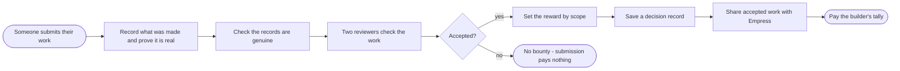

# Contribution Economy Readability Redesign Implementation Plan

> **For agentic workers:** REQUIRED SUB-SKILL: Use superpowers:subagent-driven-development (recommended) or superpowers:executing-plans to implement this plan task-by-task. Steps use checkbox (`- [ ]`) syntax for tracking.

**Goal:** Redesign `docs/contribution-economy/index.html` as a sidebar + single-view presentation page, rewrite all text in plain English, and strip parentheticals/jargon from all BPMN box labels per `docs/superpowers/specs/2026-09-21-contribution-economy-readability-design.md`.

**Architecture:** A committed `rename-map.json` (old label → plain label, per file) is applied to the 25 `.bpmn` files by an exact-string replace script (name="OLD" → name="NEW"), so the BPMN diffs touch only name attributes. A committed `diagrams.json` carries the page manifest (plain-English descriptions, "who has to act" lists) plus per-diagram glossary pairs derived from the map. index.html fetches both and renders a single selected diagram at a time.

**Tech Stack:** existing bpmn-js 17.11.1 (CDN), bpmn-moddle (validation), plain HTML/CSS/JS, Node scripts in `docs/contribution-economy/scripts/`.

**Important constraints:**
- Everything lives under `docs/contribution-economy/` — no repo code touched.
- BPMN edits are NAME-ONLY: ids, flows, lanes structure, and DI coordinates are untouched; `npm run validate` must stay green (25 files OK).
- Keep labels short: task/event/gateway names ≤ ~50 chars; no `(` or `)` characters in any name anywhere; no jargon tokens (`P(a)`, `N_i`, `alpha_i`, `C_i`, `Delta`, `RCT =`) in names (glossary carries those).

---

## File Structure

```
docs/contribution-economy/
├── rename-map.json        ← NEW: { file: { old→new entries } }, includes lane names
├── diagrams.json          ← NEW: manifest + glossary per diagram
├── scripts/
│   ├── rename-diagrams.mjs      ← NEW: applies rename-map.json via exact string replace
│   └── check-consistency.mjs    ← NEW: no parens/jargon in names; map fully applied
├── package.json           ← MODIFY: add "check-consistency" script
├── bpmn/*.bpmn            ← MODIFY (names only, via script)
├── index.html             ← REWRITE
└── README.md              ← MODIFY (plain-English one-liners + mirrors + invariant pairs)
```

---

### Task 1: rename-map.json, rename script, consistency check

**Files:**
- Create: `docs/contribution-economy/rename-map.json`
- Create: `docs/contribution-economy/scripts/rename-diagrams.mjs`
- Create: `docs/contribution-economy/scripts/check-consistency.mjs`
- Modify: `docs/contribution-economy/package.json`
- Modify: all `docs/contribution-economy/bpmn/*.bpmn` (via script)

- [ ] **Step 1: Write `rename-map.json`** — the complete, verified mapping. Keys are `bpmn/` relative paths; values map exact current labels to new plain-English labels. Every entry's old value MUST exist verbatim in the file (names were extracted verbatim from the files — trust them exactly, including em-dashes, `×`, `≥`, `→` characters). Entries with `"lane": true` rename lane labels.

```json
{
  "00-master-lifecycle.bpmn": {
    "Member performs action": "A member does something",
    "Record evidence: action, context, provenance, outcome (C_2 rails)": "Record what happened and prove it is real",
    "Provenance valid?": "Is the evidence genuine?",
    "No evidence — null stays null (never 0)": "No evidence — no score",
    "Classify: propose sparse vector P(a) = [p_0 … p_21]": "Score the action across all 22 dimensions",
    "Review tier": "Which review tier?",
    "Automatic verification": "Automatic check",
    "Machine-proposed check": "Software proposes the check",
    "Random audit sample": "Spot-check a random sample",
    "Conflict-of-interest check": "Check reviewers have no stake",
    "Reviewer 1: written reasons": "Reviewer 1 writes their reasons",
    "Reviewer 2: written reasons": "Reviewer 2 writes their reasons",
    "Spawn independent reviews": "Two reviewers check independently",
    "Merge reviewer verdicts": "Join the two verdicts",
    "Appeal (deadline-bound, Tier 3 rotating panel)": "Appeal to the rotating panel",
    "Unverified — no delta, judgment stays pending (settles retroactively)": "No change — stays open",
    "Harm check — verified harm reduces or voids outcome": "Check for harm and reduce the score",
    "Delta C_i(a) = Match_i × Outcome × Verification × Calibration_i → 22 non-transferable balances": "Score each dimension and update 22 tallies",
    "Emit explanation record (action ID, dimensions, intensities, calibration version)": "Save a decision record",
    "Cycle boundary (C_10 Wheel → C_20 Judgement → C_21 World)": "Close the round",
    "Aggregate $RCT (see 21-aggregation-rct.bpmn)": "Combine into the overall score",
    "Balances updated — 22-vector remains source record": "Tallies updated — full breakdown kept",
    "Evidence Layer": { "new": "Records", "lane": true },
    "Classifier": { "new": "Scoring", "lane": true },
    "Verification": { "new": "Review", "lane": true },
    "Balance Engine": { "new": "Tallies", "lane": true },
    "Cycle Operators": { "new": "Round operators", "lane": true },
    "Tier 0": "Tier 0 — automatic",
    "Tier 1": "Tier 1 — software + audit",
    "Tier 2+": "Tier 2+ — human review"
  },
  "20-interaction-map.bpmn": {
    "Rails (serve everyone)": { "new": "Support rails", "lane": true },
    "Flow dependencies": { "new": "Handoffs", "lane": true },
    "Cycle spine": { "new": "Round backbone", "lane": true },
    "decision-steering evidence (adoption bonus)": "evidence a decision steered",
    "mentee's accepted artifact = multiplier input": "student's accepted work feeds Empress",
    "demonstrated competence = nurture evidence": "proven skill feeds Empress",
    "released resources feed health metric": "released resources feed Temperance",
    "orientee's first verified contribution": "new member's first proven work",
    "fair cycle close": "fair round close",
    "provenance settled": "records settled",
    "whole-cycle completion": "whole round done",
    "adopted rules / calibration versions": "adopted rules and tuning versions",
    "calibration updates + fairness audit": "tuning updates and fairness audit",
    "distortion audit precondition": "distortion audit required",
    "recognition must tie to verified record": "recognition tied to a proven record",
    "decision-changed evidence": "evidence a decision changed",
    "verification of resolution acceptance": "check both sides accepted",
    "verify resource release": "check resources released"
  },
  "21-aggregation-rct.bpmn": {
    "Cycle boundary — C_10 fair close, C_20 settled": "Round closed and records settled",
    "Fetch C_i balances": "Fetch each dimension's tally",
    "More dimensions?": "More dimensions to include?",
    "next i (0–21)": "next",
    "Normalize N_i(C_i) — null-preserving: null stays null, never becomes 0, never decays": "Even out the tallies — blanks stay blank",
    "Capital-derived portion?": "Money-driven portion?",
    "Exclude from voting-relevant aggregation (capital never becomes voting power)": "Keep money out of voting",
    "Merge norm paths": "Join the tally paths",
    "Spawn independent governance audits": "Run both audits in parallel",
    "C_11 Justice fairness audit: under-recognized care / mediation / maintenance": "Fairness audit for care, mediation, upkeep",
    "C_15 Devil distortion audit of dimension weights": "Audit weights for distortion",
    "Merge governance audits": "Join audit results",
    "Governance review of alpha_i weights + versioning": "Members review and version the weights",
    "Emit calibration-version explanation record": "Save which tuning version was used",
    "Chronic under-measurement check → back-pay / calibration / rule retirement": "Fix systematic under-measurement",
    "Join calibration + back-pay branches before aggregation": "Join fixes before combining",
    "RCT = aggregate(alpha_i × N_i(C_i))": "Combine into the overall score",
    "Profile preserved?": "Full breakdown kept?",
    "Use gate: eligibility/quorum only": "May the score gate access?",
    "gate eligibility/quorum — human-attributed portions, salient dims, hard caps": "access and quorum only",
    "scale voting weight": "scale votes",
    "FORBIDDEN — RCT never scales votes": "Not allowed — scores never scale votes",
    "Spawn publication tasks": "Publish in parallel",
    "Merge publication records": "Join publications",
    "Publish summary": "Publish the summary",
    "Update 22-vector as source record": "Keep the 22-score breakdown",
    "Cycle settled": "Round settled",
    "Balance Engine": { "new": "Tallies", "lane": true },
    "Normalization": { "new": "Preparation", "lane": true },
    "Governance (human)": { "new": "Human governance", "lane": true },
    "Publication": { "new": "Publishing", "lane": true }
  },
  "c00-fool.bpmn": {
    "Entry into unworked territory": "Someone tries something new",
    "Submit entry evidence": "Share what the first step was",
    "Sybil check passed?": "Did it pass the identity check?",
    "No entry credit (Sybil)": "No credit — fake identity",
    "Validate crossing (reviewer)": "A reviewer checks the first step",
    "Crossing validated?": "Did the first step hold up?",
    "Entry event = verified zero (recorded, no payment)": "Recorded but pays nothing",
    "Feed C_17 Star: orientation progress": "Share progress with orientation",
    "Validated crossing earns value": "It was real — it earns value",
    "Human Reviewer": { "new": "Reviewer", "lane": true },
    "System / Automation": { "new": "System", "lane": true }
  },
  "c01-magician.bpmn": {
    "Artifact submitted": "Someone submits their work",
    "Submit evidence: action, context, provenance, outcome": "Record what was made and prove it is real",
    "Provenance check": "Check the records are genuine",
    "Review and accept artifact (Tier 2: two independent reviewers)": "Two reviewers check the work",
    "Size delivery bounty by scope": "Set the reward by scope",
    "Emit explanation record (action ID, dimensions, intensities, calibration version)": "Save a decision record",
    "Feed C_3 Empress: accepted artifact as mentee-output input": "Share accepted work with Empress",
    "Delivery bounty to C_1 balance": "Pay the builder's tally",
    "Human Reviewer": { "new": "Reviewer", "lane": true },
    "System / Automation": { "new": "System", "lane": true }
  },
  "c02-priestess.bpmn": {
    "Record published": "Someone publishes a record",
    "Durable, attributable, findable?": "Lasting, credited, findable?",
    "Base credit on publication": "Credit for publishing",
    "Verify retrieval (usage bonus per verified retrieval)": "A reviewer confirms each real use",
    "More verified retrievals?": "More confirmed uses?",
    "Attributable and findable?": "Credited and findable?",
    "Rails for all dimensions: evidence records": "These records support all dimensions",
    "Emit explanation record (action ID, dimensions, intensities, calibration version)": "Save a decision record",
    "C_2 balance updated": "C_2 tally updated",
    "Human Reviewer": { "new": "Reviewer", "lane": true },
    "System / Automation": { "new": "System", "lane": true }
  },
  "c03-empress.bpmn": {
    "Mentee's accepted output (from C_1)": "A mentee's work was accepted",
    "Cap per mentee respected?": "Under the per-mentee cap?",
    "Cycle gate open?": "Is this round's window open?",
    "Deferred to next cycle": "Deferred to the next round",
    "Verify mentee output acceptance": "Confirm the mentee's work was accepted",
    "Conflict-farming check passed?": "Clean of staged disputes?",
    "Nurture multiplier: percentage of mentee's accepted output": "Pay a share of the mentee's work",
    "Rejected (conflict farming)": "Rejected — staged conflict",
    "No multiplier (cap exceeded)": "No share — cap exceeded",
    "Emit explanation record (action ID, dimensions, intensities, calibration version)": "Save a decision record",
    "C_3 balance updated": "C_3 tally updated",
    "Human Reviewer": { "new": "Reviewer", "lane": true },
    "System / Automation": { "new": "System", "lane": true }
  },
  "c04-emperor.bpmn": {
    "Rule change proposed": "Someone proposes a rule change",
    "Draft rule change": "Draft the change",
    "Ratification vote": "Members vote to adopt it",
    "No bounty (proposal alone pays nothing)": "No reward — a proposal alone pays nothing",
    "Governance bounty on adopted change": "Reward the adopted change",
    "Emit explanation record": "Save a decision record",
    "Feed aggregation: adopted rule → calibration version": "New rule becomes a tuning version",
    "C_4 balance updated": "C_4 tally updated",
    "Human Reviewer": { "new": "Reviewer", "lane": true },
    "System / Automation": { "new": "System", "lane": true }
  },
  "c05-hierophant.bpmn": {
    "Teaching claimed": "Someone claims they taught",
    "Lecture or attendance only?": "Only a lecture or attendance?",
    "No credit (never pays on lectures or attendance)": "No credit — lectures alone pay nothing",
    "Review demonstrated competence in another member": "A reviewer confirms someone can do it",
    "Competence credit": "Credit the teacher",
    "Emit explanation record (action ID, dimensions, intensities, calibration version)": "Save a decision record",
    "Feed C_3 Empress: competence as nurture evidence": "Share as nurture evidence with Empress",
    "C_5 balance updated": "C_5 tally updated",
    "Human Reviewer": { "new": "Reviewer", "lane": true },
    "System / Automation": { "new": "System", "lane": true }
  },
  "c06-lovers.bpmn": {
    "Joint build declared": "A joint build is declared",
    "Declare joint build with attribution shares": "Declare who built what",
    "Review genuine joint contribution + verified attribution": "Confirm it was a real joint build",
    "Conflict farming check passed?": "Clean of staged disputes?",
    "Rejected (conflict farming)": "Rejected — staged conflict",
    "Shared delivery bounty split by verified attribution": "Split the reward by proven share",
    "Emit explanation record": "Save a decision record",
    "Feed C_1 Magician: joint artifact acceptance": "Link the accepted work to Magician",
    "C_6 balance updated": "C_6 tally updated",
    "Human Reviewer": { "new": "Reviewer", "lane": true },
    "System / Automation": { "new": "System", "lane": true }
  },
  "c07-chariot.bpmn": {
    "Milestone plan committed": "Someone commits to milestones",
    "Verify milestone completion": "Confirm the milestone is done",
    "Harm detected (verified)?": "Did it cause proven harm?",
    "Net-of-harm adjustment (reduce or void outcome)": "Reduce or void for harm",
    "Merge paths": "Join paths",
    "Milestone token": "Credit the milestone",
    "Emit explanation record": "Save a decision record",
    "Feed C_14 Temperance: milestone health context": "Share milestone health with Temperance",
    "C_7 balance updated": "C_7 tally updated",
    "Human Reviewer": { "new": "Reviewer", "lane": true },
    "System / Automation": { "new": "System", "lane": true }
  },
  "c08-strength.bpmn": {
    "Live dispute opened": "A dispute opens",
    "Assign non-party resolver": "Pick a resolver who is not involved",
    "Verify resolver is not a party": "Confirm the resolver is neutral",
    "Resolver qualified?": "Is the resolver qualified?",
    "Resolution token sized by severity": "Reward sized by severity",
    "Both acceptances received?": "Did both sides accept in writing?",
    "No resolution token (both acceptances required)": "No reward — both sides must accept",
    "Emit explanation record": "Save a decision record",
    "Feed C_18 Moon: resolution record for verification": "Send the resolution for verification",
    "C_8 balance updated": "C_8 tally updated",
    "Human Reviewer": { "new": "Reviewer", "lane": true },
    "System / Automation": { "new": "System", "lane": true }
  },
  "c09-hermit.bpmn": {
    "Research finding delivered": "A research finding arrives",
    "Milestone evidence review": "A reviewer checks milestone evidence",
    "Deep-work bounty at milestones": "Pay at proven milestones",
    "Payment trigger = milestone?": "Is progress measured by milestones?",
    "No bounty (never pays on length)": "No reward — length alone pays nothing",
    "Finding steers a vote?": "Did the finding steer a vote?",
    "Verify decision-steering evidence": "Confirm the finding steered a decision",
    "Adoption bonus": "Bonus when adopted",
    "Merge paths": "Join paths",
    "Emit explanation record": "Save a decision record",
    "Feed C_20 Judgement: adoption evidence": "Share adoption evidence with Judgement",
    "C_9 balance updated": "C_9 tally updated",
    "Human Reviewer": { "new": "Reviewer", "lane": true },
    "System / Automation": { "new": "System", "lane": true }
  },
  "c10-wheel.bpmn": {
    "Cycle end reached": "The round ends",
    "Fairness audit of cycle (human)": "A person audits the round's fairness",
    "Cycle fair?": "Was the round fair?",
    "Log cycle debt (measurement failure is the system's debt)": "Record the round's debt",
    "Retrial next cycle": "Retried in the next round",
    "Cycle-completion credit": "Credit for closing the round",
    "Emit explanation record (action ID, dimensions, intensities, calibration version)": "Save a decision record",
    "Fire cycle-boundary event (to 21-aggregation-rct.bpmn)": "Start the scoring roundup",
    "C_10 balance updated": "C_10 tally updated",
    "Human Reviewer": { "new": "Reviewer", "lane": true },
    "System / Automation": { "new": "System", "lane": true }
  },
  "c11-justice.bpmn": {
    "Audit scheduled": "An audit is scheduled",
    "Execute fairness audit (human-only bootstrap)": "Run the fairness audit by hand",
    "Audit token per completed audit": "Credit per finished audit",
    "Under-recognition (care/mediation/maintenance)?": "Were quiet kinds of work missed?",
    "Trigger back-pay / calibration / rule retirement": "Trigger back-pay, retuning, or retirement",
    "Merge paths": "Join paths",
    "Emit explanation record": "Save a decision record",
    "C_11 balance updated": "C_11 tally updated",
    "Human Reviewer": { "new": "Reviewer", "lane": true },
    "System / Automation": { "new": "System", "lane": true }
  },
  "c12-hanged-man.bpmn": {
    "Reframe proposed": "Someone reframes the problem",
    "Pause duration only?": "Just a pause, nothing else?",
    "No credit (never pays on pause)": "No credit — pausing alone pays nothing",
    "Review decision-delta evidence": "A reviewer checks the decision changed",
    "Decision actually changed?": "Did the decision really change?",
    "No decision change — no credit": "No decision change — no credit",
    "Decision-changed credit": "Credit the reframe",
    "Emit explanation record": "Save a decision record",
    "Feed C_20 Judgement: decision-change record": "Record the change for Judgement",
    "C_12 balance updated": "C_12 tally updated",
    "Human Reviewer": { "new": "Reviewer", "lane": true },
    "System / Automation": { "new": "System", "lane": true }
  },
  "c13-death.bpmn": {
    "Closure chosen": "Someone ends the thing",
    "Review preserved learning": "Check the learning was preserved",
    "Verify resource release": "Confirm resources were released",
    "Real closure (not abandonment)?": "Was it ended, not abandoned?",
    "Rejected (closure theater)": "Rejected — it was theater",
    "Closure token": "Credit the one who closed it",
    "Emit explanation record": "Save a decision record",
    "Feed C_14 Temperance: released resources": "Released resources feed Temperance",
    "C_13 balance updated": "C_13 tally updated",
    "Human Reviewer": { "new": "Reviewer", "lane": true },
    "System / Automation": { "new": "System", "lane": true }
  },
  "c14-temperance.bpmn": {
    "Health metric monitoring cycle": "Each round checks the health measure",
    "Metric in range?": "Is the measure in range?",
    "Holding credit per in-range interval": "Credit for holding it in range",
    "Stall detected?": "Has progress stalled?",
    "Stall remediation (human)": "A person fixes the stall",
    "No credit (out of range)": "No credit — out of range",
    "Emit explanation record": "Save a decision record",
    "Consumes resources released by C_13 Death": "Uses resources released by Death",
    "C_14 balance updated": "C_14 tally updated",
    "Human Reviewer": { "new": "Reviewer", "lane": true },
    "System / Automation": { "new": "System", "lane": true }
  },
  "c15-devil.bpmn": {
    "Incentive distortion claim filed": "Someone reports a skewed incentive",
    "Corroboration by independent member (≥ 1)": "A second person confirms it",
    "Claim corroborated?": "Is the claim confirmed?",
    "Devil operator audit of weights (human-only bootstrap)": "A person audits the dimension weights",
    "Integrity bounty (among the largest payouts)": "Integrity reward — one of the largest",
    "Emit explanation record": "Save a decision record",
    "Feed C_11 Justice + aggregation: distortion finding": "Report the distortion to Justice",
    "C_15 balance updated": "C_15 tally updated",
    "Human Reviewer": { "new": "Reviewer", "lane": true },
    "System / Automation": { "new": "System", "lane": true }
  },
  "c16-tower.bpmn": {
    "Crisis event detected": "A crisis is spotted",
    "Verify crisis via C_18 Moon": "Moon verifies the crisis",
    "Crisis verified?": "Is the crisis real?",
    "No token (detection alone pays nothing)": "No reward — spotting alone pays nothing",
    "Caused by responder's own failure?": "Did the responder cause it?",
    "No token (caused failure)": "No reward — the responder caused it",
    "Size token by severity": "Size the reward by severity",
    "Crisis token for stabilization": "Reward for stabilizing",
    "Emit explanation record": "Save a decision record",
    "Feed C_13 Death: stabilization record": "Share the record with Death",
    "C_16 balance updated": "C_16 tally updated",
    "Human Reviewer": { "new": "Reviewer", "lane": true },
    "System / Automation": { "new": "System", "lane": true }
  },
  "c17-star.bpmn": {
    "New member oriented": "A new member is being oriented",
    "Orientation session (human)": "A person runs the orientation",
    "Attendance only?": "Only attendance, nothing more?",
    "No credit (attendance pays nothing)": "No credit — showing up pays nothing",
    "Orientee completed first verified contribution?": "Did the new member finish first proven work?",
    "Pending (no credit yet)": "Pending — no credit yet",
    "Onboarding credit": "Credit the guide",
    "Emit explanation record": "Save a decision record",
    "Feed C_0 Fool: entry progress": "Share entry progress with the Fool",
    "C_17 balance updated": "C_17 tally updated",
    "Human Reviewer": { "new": "Reviewer", "lane": true },
    "System / Automation": { "new": "System", "lane": true }
  },
  "c18-moon.bpmn": {
    "Pending claim enqueued": "A claim needs checking",
    "More pending claims?": "More pending claims?",
    "Complete verification check": "A reviewer checks a pending claim",
    "Verification token per completed check (any direction)": "Credit per finished check",
    "Track accuracy vs chance": "Track accuracy above chance",
    "Reviewer capture suspected?": "Do reviewers look captured?",
    "Rotate reviewer pool (Tier 3)": "Swap in new reviewers",
    "Emit explanation record": "Save a decision record",
    "Verdicts feed all dimensions' pending claims": "Verdicts feed all pending claims",
    "C_18 balance updated": "C_18 tally updated",
    "Queue drained": "Queue drained",
    "Human Reviewer": { "new": "Reviewer", "lane": true },
    "System / Automation": { "new": "System", "lane": true }
  },
  "c19-sun.bpmn": {
    "Recognition nomination": "Someone is nominated",
    "Tied to verified record?": "Tied to a proven record?",
    "Rejected (popularity alone pays nothing)": "Rejected — popularity alone pays nothing",
    "Recognition review": "A reviewer checks the record",
    "Recognition credit": "Credit the recognition",
    "Emit explanation record": "Save a decision record",
    "Feed C_2 Priestess: recognized record link": "Link the recognition to the record",
    "C_19 balance updated": "C_19 tally updated",
    "Human Reviewer": { "new": "Reviewer", "lane": true },
    "System / Automation": { "new": "System", "lane": true }
  },
  "c20-judgement.bpmn": {
    "Cycle reckoning": "End-of-round reckoning",
    "Provenance settlement (human-only bootstrap)": "People settle the records",
    "Unresolved judgments?": "Any unresolved calls?",
    "Keep pending (settles retroactively when evidence arrives)": "Leave open until evidence arrives",
    "next cycle": "next round",
    "Reckoning credit": "Credit the settling",
    "Emit explanation record": "Save a decision record",
    "Fire aggregation precondition (provenance settled)": "Mark the records settled",
    "C_20 balance updated": "C_20 tally updated",
    "Human Reviewer": { "new": "Reviewer", "lane": true },
    "System / Automation": { "new": "System", "lane": true }
  },
  "c21-world.bpmn": {
    "Whole-cycle completion claimed": "Someone claims the whole round is done",
    "Verify completion of the whole (human)": "A person confirms the round completed",
    "All cycle dimensions settled?": "Is every part of the round settled?",
    "Incomplete (defer)": "Incomplete — defer",
    "Completion credit": "Credit the completion",
    "Emit explanation record": "Save a decision record",
    "Close cycle spine (enable $RCT publication)": "Close the round so scores can publish",
    "C_21 balance updated": "C_21 tally updated",
    "Human Reviewer": { "new": "Reviewer", "lane": true },
    "System / Automation": { "new": "System", "lane": true }
  }
}
```

- [ ] **Step 2: Write `scripts/rename-diagrams.mjs`** — exact-string replace, fail-fast on any unmapped or missing old label:

```js
import { readFile, writeFile } from 'node:fs/promises';
import path from 'node:path';
import { fileURLToPath } from 'node:url';

const root = path.join(path.dirname(fileURLToPath(import.meta.url)), '..');
const map = JSON.parse(await readFile(path.join(root, 'rename-map.json'), 'utf8'));

let applied = 0;
for (const [file, entries] of Object.entries(map)) {
  const filePath = path.join(root, 'bpmn', file);
  let xml = await readFile(filePath, 'utf8');
  for (const [oldLabel, entry] of Object.entries(entries)) {
    const newLabel = typeof entry === 'string' ? entry : entry.new;
    const needle = `name="${oldLabel}"`;
    const count = (xml.match(new RegExp(escapeRegExp(needle), 'g')) || []).length;
    if (count === 0) {
      console.error(`FAIL ${file}: old label not found: ${needle}`);
      process.exit(1);
    }
    xml = xml.split(needle).join(`name="${newLabel}"`);
    applied += count;
  }
  await writeFile(filePath, xml);
}
console.log(`Applied ${applied} renames across ${Object.keys(map).length} files. Make sure to run npm run validate next.`);

function escapeRegExp(s) {
  return s.replace(/[.*+?^${}()|[\]\\]/g, '\\$&');
}
```

- [ ] **Step 3: Write `scripts/check-consistency.mjs`**

```js
import { readFile, readdir } from 'node:fs/promises';
import path from 'node:path';
import { fileURLToPath } from 'node:url';

const root = path.join(path.dirname(fileURLToPath(import.meta.url)), '..');
const map = JSON.parse(await readFile(path.join(root, 'rename-map.json'), 'utf8'));
const files = (await readdir(path.join(root, 'bpmn'))).filter(f => f.endsWith('.bpmn'));

const FORBIDDEN = ['(', ')', 'P(a)', 'N_i', 'alpha_i', 'C_i(', 'Delta C', 'RCT ='];
let failed = 0;

for (const f of files) {
  const xml = await readFile(path.join(root, 'bpmn', f), 'utf8');
  const names = [...xml.matchAll(/name="([^"]*)"/g)].map(m => m[1]);
  for (const n of names) {
    for (const bad of FORBIDDEN) {
      if (n.includes(bad)) {
        console.error(`FAIL ${f}: forbidden token "${bad}" in label "${n}"`);
        failed++;
      }
    }
  }
  for (const oldLabel of Object.keys(map[f] ?? {})) {
    if (xml.includes(`name="${oldLabel}"`)) {
      console.error(`FAIL ${f}: old label still present: "${oldLabel}"`);
      failed++;
    }
  }
  const entries = Object.values(map[f] ?? {});
  if (entries.length) {
    for (const entry of entries) {
      const newLabel = typeof entry === 'string' ? entry : entry.new;
      if (!xml.includes(`name="${newLabel}"`)) {
        console.error(`FAIL ${f}: new label missing: "${newLabel}"`);
        failed++;
      }
    }
  }
}
if (failed === 0) console.log('Consistency check passed: all renames applied, no parentheses or jargon in labels.');
process.exit(failed ? 1 : 0);
```

- [ ] **Step 4: Add the npm script and apply**

In `docs/contribution-economy/package.json` scripts, add `"check-consistency": "node scripts/check-consistency.mjs"`:

```json
"scripts": {
  "validate": "node validate.mjs",
  "check-consistency": "node scripts/check-consistency.mjs"
}
```

Run from `docs/contribution-economy`:
```
node scripts/rename-diagrams.mjs
npm run validate
npm run check-consistency
```
Expected: "Applied N renames across 25 files" (N around 240–260), then 25 × `OK` exit 0, then "Consistency check passed". If the rename script fails on a missing old label, fix the map to match the file's exact text (do not relax the fail-fast behavior).

- [ ] **Step 5: Diff check** — `git diff --stat docs/contribution-economy/bpmn/` should show changes in all 25 files, and the diff should contain ONLY `name=` attribute text changes (no DI/structure lines). Spot-check with `git diff docs/contribution-economy/bpmn/c01-magician.bpmn | head -60`.

- [ ] **Step 6: Commit**

```bash
git add docs/contribution-economy/rename-map.json docs/contribution-economy/scripts docs/contribution-economy/package.json docs/contribution-economy/bpmn
git commit -m "docs(contribution-economy): rename BPMN labels to plain English via rename map"
```

---

### Task 2: diagrams.json (manifest + glossary)

**Files:**
- Create: `docs/contribution-economy/diagrams.json`

- [ ] **Step 1: Author `diagrams.json`.** Structure: `{ "sections": [...], "overview": {...}, "diagrams": [ { id, file, title, badge, description, whoActs[], glossary[ { plain, technical } ] } ] }`.

  - `sections`: `[ "Core workflows", "Specified dimensions", "Proposed interpretation" ]` — render order: a synthetic Overview page first, then the sections.
  - `overview`: title "How contribution works here", and one plain-English intro: **"Every contribution is scored across 22 dimensions. Work only counts when it produces a verified result — showing up, talking, or pausing never earns anything. Each score is adjusted by how well the work matched the intent, what it actually achieved, how strongly it was verified, and the DAO's latest tuning. Scores can't be transferred between people, and the overall score gates access and quorum but never makes votes heavier."** + anti-gaming summary (rewrite the existing one plainly): **"The system watches for its own failure modes: fake identities (C_0), trying to be paid for attendance or talk instead of results (every diagram), staged disputes (C_3, C_6), fake endings (C_13), reviewers getting captured (C_18 rotates them out), people exploiting system settings (C_15 exposes them and C_11 audits), and work being systematically missed (triggers back-pay, retuning, or rule retirement)."** + a dependency digest: **"Who feeds whom: C_2 records support every dimension; C_18 verifies pending claims everywhere; C_1's accepted work feeds C_3 nurturing; C_5's proven skills also feed C_3; C_9 and C_12 findings reach C_20 at round end; C_13's released resources feed C_14's health measure; C_17 orientation feeds C_0 entry; C_15 distortion reports reach C_11 and scoring; C_11 tuning updates reach scoring; the round spine C_10 → C_21 opens scoring; C_4's adopted rules update tuning; C_19 recognition must link to a proven record; C_16 crises must be verified by C_18."**
  - `diagrams`: 25 entries. For each: `id` (slug), `file`, `title`, `badge` ('core' | 'specified' | 'proposed'), `description` (plain English, one or two sentences, no jargon), `whoActs` (plain-English list of human interactions), `glossary` (array of `{ plain, technical }` pairs: plain = new box label, technical = what it replaced or the spec term — derive from `rename-map.json` for that file; only include pairs where the plain label hides something a domain-expert would need: drop self-explanatory pairs like flow-label renames and lane names).

  Descriptions must be rewritten plainly (examples — follow this register for all 25; use these exact descriptions):

```json
[
  { "id": "master", "file": "bpmn/00-master-lifecycle.bpmn", "title": "Master Contribution Lifecycle", "badge": "core",
    "description": "How any action becomes a contribution. The member records what happened, the system scores it across all 22 dimensions, reviewers check it, harm pulls the score down, and at the end of each round the 22 tallies combine into the overall score.",
    "whoActs": ["Software spot-checks are audited at random", "Two independent reviewers write their reasons for important work", "A rotating panel handles appeals on a deadline"] },
  { "id": "interaction-map", "file": "bpmn/20-interaction-map.bpmn", "title": "Dimension Interaction Map", "badge": "core",
    "description": "How the 22 dimensions feed each other. Records and reviews support everything, handoffs pass evidence between dimensions, and the round's closing steps lead to scoring.",
    "whoActs": [] },
  { "id": "aggregation", "file": "bpmn/21-aggregation-rct.bpmn", "title": "Overall Score Aggregation", "badge": "core",
    "description": "How 22 tallies become one overall score at the end of each round. Money-driven parts never count toward voting. Members review and re-tune the dimension weights by hand before combining.",
    "whoActs": ["Members review and version the dimension weights", "A fairness audit looks for missed care, mediation, and upkeep", "An audit checks the weights for distortion", "Members decide back-pay or re-tuning when measurement keeps failing"] },
  { "id": "c00", "file": "bpmn/c00-fool.bpmn", "title": "C_0 Fool — Entry", "badge": "specified",
    "description": "Rewards being first to step into genuinely new territory. The first step itself is recorded but pays nothing — it earns value only once a reviewer confirms it was real.",
    "whoActs": ["A reviewer checks the first step"] },
  { "id": "c01", "file": "bpmn/c01-magician.bpmn", "title": "C_1 Magician — Building", "badge": "specified",
    "description": "Rewards building something real. Payment happens on acceptance and is sized by scope — submitting work alone earns nothing.",
    "whoActs": ["Two reviewers check the work", "The reward is set by scope"] },
  { "id": "c02", "file": "bpmn/c02-priestess.bpmn", "title": "C_2 Priestess — Recording", "badge": "specified",
    "description": "Rewards records that last, are credited to an author, and can be found again. Publishing earns a base credit; every confirmed later use earns a bonus.",
    "whoActs": ["A reviewer confirms each real use of the record"] },
  { "id": "c03", "file": "bpmn/c03-empress.bpmn", "title": "C_3 Empress — Nurturing", "badge": "specified",
    "description": "Rewards helping someone else grow. The reward is a share of the mentee's accepted work, capped per mentee and paid once per round.",
    "whoActs": ["A reviewer confirms the mentee's work was accepted"] },
  { "id": "c04", "file": "bpmn/c04-emperor.bpmn", "title": "C_4 Emperor — Rule Changes", "badge": "proposed",
    "description": "Rewards rule changes the DAO actually adopts — proposing alone earns nothing.",
    "whoActs": ["Members vote to adopt the change"] },
  { "id": "c05", "file": "bpmn/c05-hierophant.bpmn", "title": "C_5 Hierophant — Teaching", "badge": "specified",
    "description": "Rewards teaching proven by someone actually being able to do the thing — lectures and attendance alone pay nothing.",
    "whoActs": ["A reviewer confirms someone can now do it"] },
  { "id": "c06", "file": "bpmn/c06-lovers.bpmn", "title": "C_6 Lovers — Joint Builds", "badge": "proposed",
    "description": "Rewards genuine joint builds, with the shared payoff split by proven share of the work.",
    "whoActs": ["A reviewer confirms it was a real joint build"] },
  { "id": "c07", "file": "bpmn/c07-chariot.bpmn", "title": "C_7 Chariot — Milestones", "badge": "proposed",
    "description": "Rewards completed milestones, reduced or voided if the work caused proven harm.",
    "whoActs": ["A reviewer confirms the milestone is done"] },
  { "id": "c08", "file": "bpmn/c08-strength.bpmn", "title": "C_8 Strength — Resolving", "badge": "specified",
    "description": "Rewards resolving a live dispute. The resolver must be neutral, the reward is sized by severity, and both sides must accept the resolution in writing.",
    "whoActs": ["A neutral resolver is picked and checked", "Both parties accept the outcome in writing"] },
  { "id": "c09", "file": "bpmn/c09-hermit.bpmn", "title": "C_9 Hermit — Discovering", "badge": "specified",
    "description": "Rewards deep research by proven milestones — page count earns nothing. A finding that steers a real vote earns an adoption bonus.",
    "whoActs": ["A reviewer checks milestone evidence", "A reviewer confirms the finding steered a decision"] },
  { "id": "c10", "file": "bpmn/c10-wheel.bpmn", "title": "C_10 Wheel — Fair Cycle Completion", "badge": "proposed",
    "description": "Rewards closing a round fairly. If the audit finds the round unfair, the system records the debt and retries next round.",
    "whoActs": ["A person audits the round's fairness"] },
  { "id": "c11", "file": "bpmn/c11-justice.bpmn", "title": "C_11 Justice — Audits", "badge": "proposed",
    "description": "Rewards running fairness audits, which stay human-only during the early phase. Missed care, mediation, or upkeep triggers back-pay, re-tuning, or rule retirement.",
    "whoActs": ["A person runs the fairness audit"] },
  { "id": "c12", "file": "bpmn/c12-hanged-man.bpmn", "title": "C_12 Hanged Man — Re-seeing", "badge": "specified",
    "description": "Rewards reframing a problem in a way that changes a real decision — sitting in a pause earns nothing.",
    "whoActs": ["A reviewer checks that the decision really changed"] },
  { "id": "c13", "file": "bpmn/c13-death.bpmn", "title": "C_13 Death — Ending", "badge": "specified",
    "description": "Rewards clean endings: learning preserved and resources released. Endings staged for appearance get nothing.",
    "whoActs": ["A person checks the learning was preserved", "A person confirms resources were released"] },
  { "id": "c14", "file": "bpmn/c14-temperance.bpmn", "title": "C_14 Temperance — Health in Range", "badge": "proposed",
    "description": "Rewards keeping a health measure in a healthy range, with stall detection to catch quiet stops.",
    "whoActs": ["A person fixes the stall"] },
  { "id": "c15", "file": "bpmn/c15-devil.bpmn", "title": "C_15 Devil — Exposing", "badge": "specified",
    "description": "Rewards exposing a skewed incentive. It needs a second person to confirm, pays one of the largest rewards, and false claims are penalized.",
    "whoActs": ["A second person confirms the claim", "A person audits the dimension weights"] },
  { "id": "c16", "file": "bpmn/c16-tower.bpmn", "title": "C_16 Tower — Crisis Response", "badge": "specified",
    "description": "Rewards stabilizing a verified crisis. Spotting one earns nothing, and causing it earns nothing.",
    "whoActs": ["Moon verifies the crisis is real", "The reward is sized by severity"] },
  { "id": "c17", "file": "bpmn/c17-star.bpmn", "title": "C_17 Star — Orientation", "badge": "proposed",
    "description": "Rewards a guide when their new member completes a first proven contribution — running sessions alone pays nothing.",
    "whoActs": ["A person runs the orientation"] },
  { "id": "c18", "file": "bpmn/c18-moon.bpmn", "title": "C_18 Moon — Verifying", "badge": "specified",
    "description": "Rewards finishing verification checks in either direction. Accuracy is tracked against chance, and suspicious reviewer patterns rotate reviewers out.",
    "whoActs": ["A reviewer checks each pending claim", "Reviewers get swapped if capture is suspected"] },
  { "id": "c19", "file": "bpmn/c19-sun.bpmn", "title": "C_19 Sun — Public Recognition", "badge": "proposed",
    "description": "Rewards public recognition only when it links to a proven record — popularity alone earns nothing.",
    "whoActs": ["A reviewer checks the record"] },
  { "id": "c20", "file": "bpmn/c20-judgement.bpmn", "title": "C_20 Judgement — Reckoning", "badge": "proposed",
    "description": "Rewards settling the round's records — human-only during the early phase. Unresolved calls stay open and settle when evidence arrives.",
    "whoActs": ["People settle the records"] },
  { "id": "c21", "file": "bpmn/c21-world.bpmn", "title": "C_21 World — Completion", "badge": "proposed",
    "description": "Rewards completing the whole round once every part is settled. Incomplete rounds wait.",
    "whoActs": ["A person confirms the round completed"] }
]
```

  Fill in `glossary` per diagram from `rename-map.json` (non-trivial pairs only). Example for `c01`, from the c01 map entries:

```json
"glossary": [
  { "plain": "Record what was made and prove it is real", "technical": "evidence record with action, context, provenance, outcome" },
  { "plain": "Two reviewers check the work", "technical": "Tier 2 review — two independent reviewers" },
  { "plain": "Save a decision record", "technical": "explanation record — action ID, dimensions, intensities, tuning version" },
  { "plain": "Share accepted work with Empress", "technical": "feeds C_3's nurture multiplier input" },
  { "plain": "A reviewer", "technical": "the 'Reviewer' lane (was 'Human Reviewer')" }
]
```

- [ ] **Step 2: JSON validity + completeness check** — `node -e "const d=require('./diagrams.json'); console.log(d.diagrams.length)"` from `docs/contribution-economy` prints `25`; every `file` exists on disk; ids unique.

- [ ] **Step 3: Commit**

```bash
git add docs/contribution-economy/diagrams.json
git commit -m "docs(contribution-economy): diagrams.json manifest and glossary data"
```

---

### Task 3: index.html rewrite (sidebar + single view)

**Files:**
- Modify: `docs/contribution-economy/index.html` (complete rewrite)

- [ ] **Step 1: Write the new `index.html`** — complete file:

```html
<!doctype html>
<html lang="en">
<head>
<meta charset="utf-8"/>
<meta name="viewport" content="width=device-width, initial-scale=1"/>
<title>ResonantDAO — Contribution Economy Workflows</title>
<style>
  :root { --bg: #14181d; --panel: #1b2128; --line: #2a3138; --text: #e6e6e6; --muted: #9aa7b1;
          --link: #7fb4d6; --accent: #d0b26a; --btn: #2a4a66; --btn-hover: #35597a; }
  * { box-sizing: border-box; }
  body { font-family: system-ui, sans-serif; font-size: 16px; margin: 0; background: var(--bg); color: var(--text); }
  header { padding: 16px 24px; border-bottom: 1px solid var(--line); display: flex; align-items: baseline; gap: 16px; }
  header h1 { font-size: 20px; margin: 0; }
  header p { color: var(--muted); margin: 0; font-size: 14px; }
  #menu-btn { display: none; margin-right: 12px; }
  .shell { display: flex; min-height: calc(100vh - 61px); }
  aside { width: 260px; flex: 0 0 260px; border-right: 1px solid var(--line); padding: 16px 0; overflow-y: auto;
          position: sticky; top: 61px; height: calc(100vh - 61px); background: var(--bg); }
  aside h3 { font-size: 12px; text-transform: uppercase; letter-spacing: 0.06em; color: var(--muted); margin: 18px 20px 6px; }
  aside a { display: block; padding: 6px 20px; color: var(--link); text-decoration: none; font-size: 14px;
            border-left: 3px solid transparent; }
  aside a:hover { background: var(--panel); }
  aside a.active { border-left-color: var(--accent); background: var(--panel); color: var(--text); }
  aside a .chip { font-size: 11px; color: var(--accent); margin-left: 6px; }
  main { flex: 1 1 auto; min-width: 0; padding: 24px 32px; }
  main h2 { font-size: 22px; margin: 0 0 4px; }
  .badge { font-size: 11px; padding: 2px 8px; border-radius: 10px; vertical-align: middle; }
  .badge.specified { background: #1d4028; color: #7fd694; }
  .badge.proposed { background: #4a3a12; color: #e6c25a; }
  .badge.core { background: #1d3550; color: #7fb4d6; }
  .desc { color: var(--muted); font-size: 15px; margin: 8px 0 0; max-width: 65em; }
  .who { font-size: 14px; margin: 12px 0 0; }
  .who b { color: var(--accent); }
  .who li { margin: 2px 0; }
  .controls { display: flex; gap: 8px; margin: 16px 0 10px; flex-wrap: wrap; }
  button { background: var(--btn); color: #fff; border: 0; border-radius: 4px; padding: 7px 14px;
           font-size: 14px; cursor: pointer; }
  button:hover { background: var(--btn-hover); }
  .canvas { height: min(62vh, 1200px); min-height: 500px; border: 1px solid var(--line); border-radius: 6px; background: #fff; }
  .error { color: #e67e7e; padding: 24px; }
  table.glossary { border-collapse: collapse; margin-top: 20px; width: 100%; max-width: 65em; font-size: 14px; }
  table.glossary th, table.glossary td { text-align: left; padding: 6px 12px; border-bottom: 1px solid var(--line); vertical-align: top; }
  table.glossary th { color: var(--muted); font-weight: 600; font-size: 13px; }
  table.glossary td.technical { color: var(--muted); }
  .overview { max-width: 65em; }
  .overview p, .overview li { color: var(--muted); font-size: 15px; line-height: 1.6; }
  .overview h3 { margin: 20px 0 6px; }
  @media (max-width: 1023px) {
    aside { position: fixed; left: -280px; top: 0; height: 100vh; z-index: 50; width: 280px; flex-basis: 280px;
            transition: left 0.2s; border-right: 1px solid var(--line); }
    aside.open { left: 0; }
    #menu-btn { display: inline-block; }
    main { padding: 16px; }
    .canvas { min-height: 420px; height: min(60vh, 900px); }
  }
</style>
</head>
<body>
<header>
  <button id="menu-btn" aria-label="Open navigation">☰</button>
  <h1>ResonantDAO — Contribution Economy Workflows (v2)</h1>
  <p>22 dimensions · one round at a time · scores gate access, never vote weight</p>
</header>
<div class="shell">
  <aside id="nav"></aside>
  <main id="content"></main>
</div>
<script src="https://unpkg.com/bpmn-js@17.11.1/dist/bpmn-navigated-viewer.development.js"></script>
<script>
const main = document.getElementById('content');
const nav = document.getElementById('nav');
let viewer = null;

async function loadData() {
  const d = await (await fetch('diagrams.json')).json();
  buildNav(d);
  const initial = location.hash ? location.hash.slice(1) : 'overview';
  select(d, initial);
  window.addEventListener('hashchange', () => select(d, location.hash.slice(1)));
  document.getElementById('menu-btn').addEventListener('click', () => nav.classList.toggle('open'));
}

function buildNav(d) {
  const sections = [['overview', 'Overview']];
  for (const s of d.sections) sections.push([s, s]);
  for (const [id, title] of sections) {
    const h = document.createElement('h3');
    h.textContent = title;
    nav.appendChild(h);
    const items = id === 'overview' ? [{ id: 'overview', title: 'How contribution works here' }]
                                    : d.diagrams.filter(x => groupOf(x.badge) === id);
    for (const item of items) {
      const a = document.createElement('a');
      a.href = '#' + item.id;
      a.dataset.sel = item.id;
      a.innerHTML = esc(item.title) + (item.badge === 'proposed' ? ' <span class="chip">proposed</span>' : '');
      nav.appendChild(a);
    }
  }
}

function groupOf(badge) {
  return badge === 'core' ? 'Core workflows'
       : badge === 'specified' ? 'Specified dimensions'
       : 'Proposed interpretation';
}

function select(d, id) {
  for (const a of nav.querySelectorAll('a')) a.classList.toggle('active', a.dataset.sel === id);
  nav.classList.remove('open');
  if (viewer) { viewer.destroy(); viewer = null; }
  if (id === 'overview') return renderOverview(d.overview);
  const diag = d.diagrams.find(x => x.id === id);
  if (!diag) { main.innerHTML = '<p class="error">Unknown diagram.</p>'; return; }
  renderDiagram(diag);
}

function renderOverview(o) {
  main.innerHTML =
    `<div class="overview"><h2>${esc(o.title)}</h2>` +
    `<p>${esc(o.intro)}</p><h3>How the system protects itself</h3><p>${esc(o.antigaming)}</p>` +
    `<h3>Who feeds whom</h3><p>${esc(o.dependencies)}</p></div>`;
}

function renderDiagram(diag) {
  main.innerHTML =
    `<h2>${esc(diag.title)} <span class="badge ${diag.badge}">${diag.badge === 'proposed' ? 'proposed interpretation' : diag.badge}</span></h2>` +
    `<p class="desc">${esc(diag.description)}</p>` +
    (diag.whoActs.length
      ? `<ul class="who"><b>Who has to act:</b>` + diag.whoActs.map(w => `<li>${esc(w)}</li>`).join('') + `</ul>` : '') +
    `<div class="controls"><button id="btn-zin">Zoom +</button><button id="btn-zout">Zoom −</button><button id="btn-fit">Fit</button><button id="btn-dl">Download SVG</button></div>` +
    `<div class="canvas" id="canvas"></div>` +
    (diag.glossary && diag.glossary.length
      ? `<table class="glossary"><thead><tr><th>In the diagram</th><th>What it means technically</th></tr></thead><tbody>` +
        diag.glossary.map(g => `<tr><td>${esc(g.plain)}</td><td class="technical">${esc(g.technical)}</td></tr>`).join('') +
        `</tbody></table>` : '');
  const canvas = document.getElementById('canvas');
  viewer = new BpmnJS({ container: canvas });
  fetch(diag.file).then(r => { if (!r.ok) throw new Error(r.status); return r.text(); })
    .then(xml => viewer.importXML(xml))
    .catch(err => { canvas.innerHTML = `<p class="error">Failed to render: ${esc(err.message)}</p>`; });
  document.getElementById('btn-zin').addEventListener('click', () => {
    const c = viewer.get('canvas'); c.zoom(c.zoom() * 1.25);
  });
  document.getElementById('btn-zout').addEventListener('click', () => {
    const c = viewer.get('canvas'); c.zoom(c.zoom() * 0.8);
  });
  document.getElementById('btn-fit').addEventListener('click', () => viewer.get('canvas').zoom('fit-viewport', 'auto'));
  document.getElementById('btn-dl').addEventListener('click', async () => {
    try {
      const { svg } = await viewer.saveSVG();
      const blob = new Blob([svg], { type: 'image/svg+xml' });
      const a = document.createElement('a');
      a.href = URL.createObjectURL(blob);
      a.download = diag.file.replace('bpmn/', '').replace('.bpmn', '.svg');
      a.click();
      URL.revokeObjectURL(a.href);
    } catch (err) { /* diagram failed to load; nothing to download */ }
  });
}

function esc(s) {
  return String(s).replace(/&/g, '&amp;').replace(/</g, '&lt;').replace(/>/g, '&gt;');
}

loadData().catch(err => { main.innerHTML = `<p class="error">Failed to load diagrams.json: ${esc(err.message)}</p>`; });
</script>
</body>
</html>
```

- [ ] **Step 2: Browser verify** — serve from `docs/contribution-economy` (`python3 -m http.server 8799`), open with the agent-browser skill:
  1. All 25 diagram links render their canvas (click each nav item; count "Failed to render" — expect 0).
  2. Overview page shows the three sections.
  3. Active nav item highlighted; clicking C_1 shows its glossary table and whoActs list.
  4. Zoom +/−/Fit and Download SVG work on at least two diagrams.
  5. At 800px viewport: hamburger appears, drawer opens/closes, selecting a link closes it and shows the diagram.
  6. Stop the server.

- [ ] **Step 3: Commit**

```bash
git add docs/contribution-economy/index.html
git commit -m "docs(contribution-economy): sidebar single-view layout with glossary panels"
```

---

### Task 4: README plain-English update

**Files:**
- Modify: `docs/contribution-economy/README.md`

- [ ] **Step 1: Update the intro and file index** — rewrite the "How to view" line to say: serve this directory with `python3 -m http.server` and open the served `index.html` (direct file double-click will not render). In the file index table, rewrite the one-line functions to match the plain-English descriptions in `diagrams.json` (copy them verbatim). Badge column unchanged.

- [ ] **Step 2: Update the cross-dependency table** — keep the table; no changes needed (it is already plain). Verify it still matches the interaction map.

- [ ] **Step 3: Regenerate the Mermaid mirrors from the renamed models.** For each of the 25 diagrams, read the (now renamed) `.bpmn` file and rewrite its `flowchart LR` block so every node shows the NEW label; keep node shapes ([...], ((...)), {...}) and branch edge labels (edge labels like "yes"/"no"/"next round" — use the renamed flow names). The master and aggregation mirrors must reflect the renamed steps (appeal loop, back-pay branch, forbidden branch all present). Example, C_1 after rename:



  Mermaid label rules still apply: no parentheses inside node labels, escape `$` where it would appear (after renaming, `$RCT` no longer appears in node names — confirm none of the mermaid labels contain `$`).

- [ ] **Step 4: Invariants with plain-English siblings** — under `## Invariants`, keep each technical bullet and add a "In plain terms:" child bullet. Complete list, format `- technical bullet` + two-space-indented `- **In plain terms:** ...`:

```markdown
- Pay on outcome, never on activity (submission, attendance, lecture length, pause duration earn nothing).
  - **In plain terms:** You only get credit when the work produced a verified result — not for showing up.
- Every action is multi-classified into a sparse weighted vector `P(a) = [p_0 … p_21]`.
  - **In plain terms:** One action can count toward several dimensions at once.
- Delta formula: `Delta C_i(a) = Match_i × Outcome × Verification × Calibration_i`; verified harm reduces/voids the outcome beforehand.
  - **In plain terms:** Each dimension's score grows with fit, real-world result, and verification strength, adjusted by the DAO's tuning — harm subtracts first.
- 22 non-transferable balances; `null` (no evidence) never becomes `0` (verified zero); null never decays into zero.
  - **In plain terms:** Scores belong to one person forever, and "no evidence" never quietly becomes a failed score.
- `$RCT = aggregate(alpha_i × N_i(C_i))` is a derived summary; the 22-vector remains the source record. `$RCT` may gate eligibility/quorum but never scales votes.
  - **In plain terms:** The overall score is a summary, not the truth — it can gate access but can never make a vote heavier.
- `$RES` is a separate transferable token paid only when a class-specific outcome rule fires.
  - **In plain terms:** The spendable token pays only on proven results, never for holding or transferring it.
- Voting weight draws only from human-attributed portions of balances in question-declared salient dimensions, with hard caps; capital-derived contribution never becomes voting power.
  - **In plain terms:** Only human work in the dimensions the question cares about affects vote weight — money never does.
- Every decision emits an explanation record (action ID, evidence, dimensions, intensities, calibration version, review decisions, appeal route).
  - **In plain terms:** Every scoring decision can be looked up later and appealed.
- Measurement failure is the system's debt, never the contributor's — chronic under-measurement triggers back-pay, calibration, or rule retirement.
  - **In plain terms:** If the system keeps failing to notice real work, the system owes the fix — not the worker.
```

- [ ] **Step 5: Badge note** — replace the old badge note with: "The 10 dimensions the source page only names (Chariot, Emperor, Lovers, Wheel, Justice, Temperance, Star, Sun, Judgement, World) are fully modeled here as proposed interpretations pending DAO ratification; the 12 named-and-specified dimensions and 3 core diagrams derive directly from the spec page."

- [ ] **Step 6: Checks** — lint every mermaid block (balanced brackets, valid node syntax — use mermaid 11 via jsdom in a /tmp sandbox if practical, else careful manual review of block structure); confirm: zero mermaid labels contain `(`, `)`, or raw `$`; cross-dependency table still matches `20-interaction-map.bpmn`; README "How to view" matches actual behavior for both HTTP and `file://`.

- [ ] **Step 7: Commit**

```bash
git add docs/contribution-economy/README.md
git commit -m "docs(contribution-economy): plain-English README, mirrors, and invariant pairs"
```

---

### Task 5: Final verification sweep

**Files:** none new

- [ ] **Step 1: Structural checks — run from `docs/contribution-economy`:**

```
npm run validate
npm run check-consistency
node -e "const d=require('./diagrams.json'); console.log(d.diagrams.length)"
```

Expected: 25 × `OK`; "Consistency check passed"; `25`.

- [ ] **Step 2: Browser sweep** — serve and use the agent-browser skill: all 25 nav items render (0 "Failed to render"; iterate programmatically over `nav a` hrefs, importXML each, count errors); overview page renders all 3 sections; glossary table present on at least 5 dimension cards; badges correct (3 core / 12 specified / 10 proposed); drawer works at 800px; zoom/fit/download work on two diagrams (check viewport transform scale changes). Take two screenshots (desktop full-width on C_1; mobile-width overview).

- [ ] **Step 3: Editorial read-back** — grep the rendered page text (fetch served index.html + diagrams.json) for jargon tokens: `P(a)`, `N_i`, `alpha_i`, `Delta C`, `sparse weighted vector`, `calibration` outside glossary/technical columns, and any `(` inside box labels — expect jargon only inside glossary "technical" column cells and the invariants technical bullets (README). Also read the overview text aloud once; fix any awkward sentence.

- [ ] **Step 4: Commit any fixes**

```bash
git add docs/contribution-economy
git commit -m "docs(contribution-economy): final readability sweep fixes"
```

---

## Self-review notes

- **Spec coverage:** sidebar single-view layout + responsive drawer (Task 3); plain-English text everywhere (Tasks 2, 3, 4); parens stripped from box labels (Task 1); glossary panels (Tasks 2, 3); README update (Task 4); validation (Tasks 1, 2, 4, 5).
- **rename-map completeness:** the map covers every label from the extracted name list that contains parentheses, jargon, or unclear phrasing; lane renames are per-file (dimension files: Human Reviewer → Reviewer, System / Automation → System; core files: per-file entries; aggregation: all 4 lanes; master: all 5 non-Member lanes). Labels not in the map stay as-is (already plain: "Accepted?", "yes"/"no", process names like "C_1 Magician — Building").
- **Type consistency:** `diagrams.json` fields (`id/file/title/badge/description/whoActs/glossary`) are exactly what index.html reads; `overview` fields (`title/intro/antigaming/dependencies`) match `renderOverview`.